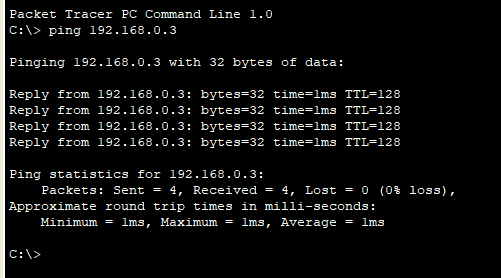

网络技术与应用实验报告（一）
==================================

-----

>专业：计算机科学与技术
>学号：2011188
>姓名：邵琦

<!-- @import "[TOC]" {cmd="toc" depthFrom=1 depthTo=6 orderedList=false} -->

<!-- code_chunk_output -->

- [一、实验要求](#一-实验要求)
  - [1.1 仿真环境下的共享式以太网组网](#11-仿真环境下的共享式以太网组网)
  - [1.2 仿真环境下的交换式以太网组网和VLAN配置](#12-仿真环境下的交换式以太网组网和vlan配置)
- [二、实验过程](#二-实验过程)
  - [2.1 仿真环境下的共享式以太网组网](#21-仿真环境下的共享式以太网组网)
    - [2.1.1 单集线器共享式以太网组网](#211-单集线器共享式以太网组网)
    - [2.1.2 多集线器共享式以太网组网](#212-多集线器共享式以太网组网)
    - [2.1.3 数据包在共享式以太网中的传递过程](#213-数据包在共享式以太网中的传递过程)
  - [2.2 仿真环境下的交换式以太网组网和VLAN配置](#22-仿真环境下的交换式以太网组网和vlan配置)
    - [2.2.1 仿真环境下进行单交换机以太网组网](#221-仿真环境下进行单交换机以太网组网)
      - [配置以太网交换机以及VLAN](#配置以太网交换机以及vlan)
      - [测试同一VLAN中主机的连通性和不同VLAN中主机的连通性](#测试同一vlan中主机的连通性和不同vlan中主机的连通性)
    - [2.2.2 在仿真环境下组建多集线器、多交换机混合式网络。划分跨越交换机的VLAN](#222-在仿真环境下组建多集线器-多交换机混合式网络划分跨越交换机的vlan)
      - [组建多集线器、多交换机混合式网络以及划分跨越交换机的VLAN](#组建多集线器-多交换机混合式网络以及划分跨越交换机的vlan)
      - [测试同一VLAN中主机的连通性和不同VLAN中主机的连通性](#测试同一vlan中主机的连通性和不同vlan中主机的连通性-1)
      - [模拟数据包在混合式以太网、虚拟局域网中的传递过程](#模拟数据包在混合式以太网-虚拟局域网中的传递过程)
- [三、实验分析](#三-实验分析)
- [四、实验总结](#四-实验总结)

<!-- /code_chunk_output -->

# 一、实验要求

## 1.1 仿真环境下的共享式以太网组网
（1）学习虚拟仿真软件的基本使用方法。

（2）在仿真环境下进行单集线器共享式以太网组网，测试网络的连通性。

（3）在仿真环境下进行多集线器共享式以太网组网，测试网络的连通性。

（4）在仿真环境的“模拟”方式中观察数据包在共享式以太网中的传递过程，并进行分析。

## 1.2 仿真环境下的交换式以太网组网和VLAN配置

（1）在仿真环境下进行单交换机以太网组网，测试网络的连通性。

（2）在仿真环境下利用终端方式对交换机进行配置。

（3）在单台交换机中划分VLAN，测试同一VLAN中主机的连通性和不同VLAN中主机的连通性，并对现象进行分析。

（4）在仿真环境下组建多集线器、多交换机混合式网络。划分跨越交换机的VLAN，测试同一VLAN中主机的连通性和不同VLAN中主机的连通性，并对现象进行分析。

（5）在仿真环境的“模拟”方式中观察数据包在混合式以太网、虚拟局域网中的传递过程，并进行分析。

（6）学习仿真环境提供的简化配置方式。

# 二、实验过程

## 2.1 仿真环境下的共享式以太网组网

### 2.1.1 单集线器共享式以太网组网

配置设备如图所示：

连接好设备后，配置IP地址，为主机填⼊IP Address，并且每⼀个主机需要选择不同的⽹络地址，同时在Subnet Mask中填⼊255.255.255.0，配置完成后返回即可，配置结果如下所示：

| PC机   | IPv4 Address |  Subnet Mask |
| :----- | :---- | :------- |
| PC1 |  192.168.0.2  | 255.255.255.0 |
| PC2 |  192.168.0.3  | 255.255.255.0 |

配置完两台主机的地址后，测试⽹络的连通性，需要在⼀个主机上开启Command Prompt，使⽤ping命令来连接另外⼀台主机，对两台主机分别使⽤ping进⾏了测试，如图所示：

### 2.1.2 多集线器共享式以太网组网

配置设备如图所示：

连接好设备后，配置IP地址，为主机填⼊IP Address，并且每⼀个主机需要选择不同的⽹络地址，同时在Subnet Mask中填⼊255.255.255.0，配置完成后返回即可，配置结果如下所示：

| PC机   | IPv4 Address |  Subnet Mask |
| :----- | :---- | :------- |
| PC1 |  192.168.0.2  | 255.255.255.0 |
| PC2 |  192.168.0.3  | 255.255.255.0 |
| PC3 |  192.168.0.4  | 255.255.255.0 |
| PC4 |  192.168.0.5  | 255.255.255.0 |
| PC5 |  192.168.0.6  | 255.255.255.0 |
| PC6 |  192.168.0.7  | 255.255.255.0 |

配置完两台主机的地址后，测试⽹络的连通性，需要在⼀个主机上开启Command Prompt，使⽤ping命令来连接另外⼀台主机，对PC1向PC6使⽤ping进⾏了测试，如图所示：

### 2.1.3 数据包在共享式以太网中的传递过程

在Simulation模式下⽤PC1去ping主机PC3可以观察到如下过程：

首先数据报从PC1发出：

然后由Hub1进⾏转发，转发到Hub4和PC2，由于⽬的主机并不是PC2，所以并不会回信息：

接下来由Hub4进⾏转发到Hub2和Hub3：

此时数据报会分别由两个集线器Hub2和Hub3转发到⾃⼰所连接的主机上，这个时刻是同时进⾏的：

PC3收到信息，往回发信息：

最后按照原路，返还信息给PC1（同意，当不是目的主机的主机收到信息，不会回信息）:

至此，传递过程结束。模拟结果如图所示：

## 2.2 仿真环境下的交换式以太网组网和VLAN配置

### 2.2.1 仿真环境下进行单交换机以太网组网

#### 配置以太网交换机以及VLAN

配置设备如图所示：

连接好设备后，配置IP地址，为主机填⼊IP Address以及VLAN，配置完成后返回即可，配置结果如下所示：

| PC机   | IPv4 Address |  Subnet Mask |　VLAN ID|
| :----- | :---- | :------- |:----|
| PC1 |  192.168.0.2  | 255.255.255.0 |1
| PC2 |  192.168.0.3  | 255.255.255.0 |1
| PC3 |  192.168.0.4  | 255.255.255.0 |2
| PC4 |  192.168.0.5  | 255.255.255.0 |2
| PC5 |  192.168.0.6  | 255.255.255.0 |3
| PC6 |  192.168.0.7  | 255.255.255.0 |3

#### 测试同一VLAN中主机的连通性和不同VLAN中主机的连通性

接下来进⾏连通性测试，让主机PC1去ping主机PC3，可以发现，由于是不同的VLAN，无法连通成功；再让主机PC1去ping主机PC2，可以发现，在同一VLAN下，连通成功。

### 2.2.2 在仿真环境下组建多集线器、多交换机混合式网络。划分跨越交换机的VLAN

#### 组建多集线器、多交换机混合式网络以及划分跨越交换机的VLAN

配置设备如图所示：

连接好设备后，配置IP地址，为主机填⼊IP Address以及VLAN，配置完成后返回即可，配置结果如下所示：

| PC机   | IPv4 Address |  Subnet Mask |　VLAN ID|
| :----- | :---- | :------- |:----|
| PC0 |  192.168.0.1  | 255.255.255.0 |1
| PC1 |  192.168.0.2  | 255.255.255.0 |1
| PC2 |  192.168.0.3  | 255.255.255.0 |1
| PC3 |  192.168.0.4  | 255.255.255.0 |2
| PC4 |  192.168.0.5  | 255.255.255.0 |2
| PC5 |  192.168.0.6  | 255.255.255.0 |2
| PC6 |  192.168.0.7  | 255.255.255.0 |2
| PC8 |  192.168.0.2  | 255.255.255.0 |2
| PC9 |  192.168.0.2  | 255.255.255.0 |2

左部的交换机配置⽅法与单交换机中⼀样，在右边的交换机的config模式下新增⼀个VLAN，然后按照对各个主机进⾏局域⽹的配置，如图所示，处在同⼀⾏同的主机处于⼀个虚拟局域⽹中。

在配置好后，将⼀个端⼝设置为trunk模式，这样就实现了交换机的VLAN的统⼀以及实现了虚拟局域⽹的统⼀。

#### 测试同一VLAN中主机的连通性和不同VLAN中主机的连通性

接下来进⾏连通性测试，让主机PC3去ping主机PC10，可以看到连通成功：

再测试不同交换机之间的不同VLAN中的主机是否能ping通，⽤主机PC1去ping主机PC9，可以看到不能连通：

则可以看出组建多集线器、多交换机混合式网络。划分跨越交换机的VLAN配置成功。

#### 模拟数据包在混合式以太网、虚拟局域网中的传递过程

⽤PC1去ping主机PC0可以观察到如下过程：

（1）⾸先数据报通过PC1发送给交换机Switch1；

（2）接下来由Switch1判断虚拟局域⽹，在判断后可以发送给了交换机Switch2（由于此时ping的是主机PC0，所以只有PC0可以进⾏收发消息，即使信息发送给了PC2，PC2也不会接收）；

（3）接下来Switch2判断跟PC1在同⼀个虚拟局域⽹中的机器，在判断完成后发送给了PC0；

（4）在PC0收到信息后，将信息返回；

（5）信息原路返回，最后发给PC1。

# 三、实验分析

问题：在数据包在共享式以太网中的传递过程中，先是出现了ARP报文传递，之后才是ICMP报文。

解决：可能是由于在传输开始时，先使用ARP报文获取IP的mac地址，在之后便可使用ICMP报文。

# 四、实验总结

通过这次实验，我了解了Cisco Packet Tracer的使用方法，更加深入地理解了以太网以及VLAN的相关知识点，对于集线器、交换机、环境配置等⽅⾯也更加的熟悉，通过仿真，对于计算机网络下信息的收发流程也有了更深刻的认识。