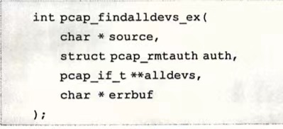
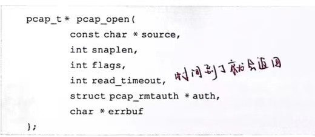
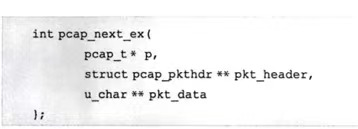
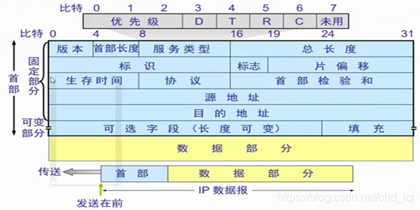
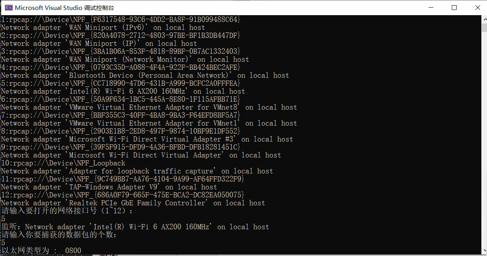
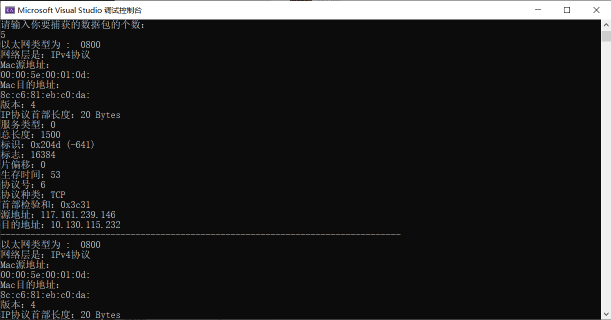

网络技术与应用实验报告（二）
==================================

-----

>专业：计算机科学与技术
>学号：2011188
>姓名：邵琦


<!-- @import "[TOC]" {cmd="toc" depthFrom=1 depthTo=6 orderedList=false} -->

<!-- code_chunk_output -->

- [网络技术与应用实验报告（二）](#网络技术与应用实验报告二)
- [一、实验要求](#一实验要求)
- [二、NPcap相关知识](#二npcap相关知识)
  - [2.1 NPcap介绍](#21-npcap介绍)
  - [2.2 NPcap特点](#22-npcap特点)
  - [2.3 NPcap架构](#23-npcap架构)
  - [2.4 设备列表获取方法](#24-设备列表获取方法)
  - [2.5 网卡设备打开方法](#25-网卡设备打开方法)
  - [2.6 数据包捕获方法](#26-数据包捕获方法)
- [三、NPcap编程](#三npcap编程)
  - [3.1 IP数据包](#31-ip数据包)
  - [3.2 主函数](#32-主函数)
  - [3.3 捕获数据包](#33-捕获数据包)
  - [3.4 IP数据报捕获](#34-ip数据报捕获)
- [四、实验结果](#四实验结果)
- [五、实验难点](#五实验难点)
  - [5.1 问题一](#51-问题一)
  - [5.2 问题二](#52-问题二)
- [六、总结](#六总结)

<!-- /code_chunk_output -->


# 一、实验要求

IP数据报捕获与分析编程实验，要求如下：

（1）了解NPcap的架构。

（2）学习NPcap的设备列表获取方法、网卡设备打开方法，以及数据包捕获方法。

（3）通过NPcap编程，实现本机的IP数据报捕获，显示捕获数据帧的源MAC地址和目的MAC地址，以及类型/长度字段的值。

（4）捕获的数据报不要求硬盘存储，但应以简单明了的方式在屏幕上显示。必显字段包括源MAC地址、目的MAC地址和类型/长度字段的值。

（5）编写的程序应结构清晰，具有较好的可读性。


# 二、NPcap相关知识

## 2.1 NPcap介绍

Npcap是致力于采用Microsoft Light-Weight Filter (NDIS 6 LWF)技术和Windows Filtering Platform (NDIS 6 WFP)技术对当前最流行的WinPcap工具包进行改进的一个项目。Npcap项目是最初2013年由Nmap网络扫描器项目（创始人Gordon Lyon）和北京大学罗杨博士发起，由Google公司的Summer of Code计划赞助的一个开源项目，遵循MIT协议（与WinPcap一致）。Npcap基于WinPcap 4.1.3源码基础上开发，支持32位和64位架构，在Windows Vista以上版本的系统中，采用NDIS 6技术的Npcap能够比原有的WinPcap数据包（NDIS 5）获得更好的抓包性能，并且稳定性更好。

## 2.2 NPcap特点

Npcap独具以下特点：

1. 支持NDIS 6技术；

2. 支持“只允许管理员Administrator”访问Npcap；

3. 支持与WinPcap兼容或并存两种模式；

4. 支持Windows平台的回环（Loopback）数据包采集；

5. 支持Windows平台的回环（Loopback）数据包发送；

## 2.3 NPcap架构

Npcap是一个包捕获（抓包）和网络分析的架构，由软件LIB库和网络驱动组成。能够：

捕获原始数据包，包括发往其运行的计算机的数据包和由其他主机交换的数据包（在共享媒体上）；

在将数据包分派给应用程序之前，根据用户指定的规则过滤数据包；

将原始数据包传输到网络；

收集有关网络流量的统计信息。

这组功能是通过设备驱动程序获得的，该驱动程序安装在Windows内核的网络部分内，并几个DLL。所有这些功能都通过功能强大的编程接口导出，可供应用程序轻松使用。本手册的主要目标是在几个示例的帮助下记录此界面。

## 2.4 设备列表获取方法

获取网络接口设备列表可以调用WinPcap提供的pcap_findalldevs_ex()函数：



## 2.5 网卡设备打开方法

在对某一网络接口卡进行监听之前，需要将其打开，打开某一网络接口设备可以调用WinPcap提供的pcap_open()函数：



## 2.6 数据包捕获方法

在打开网络接口后，可以利用NPcap提供的函数捕获流经的网络数据包。NPcap提供了多种不同的方法捕获数据包，其中，pcap_dispatch()和pcap_loop()通过回调函数将捕获的数据包传递给应用程序，而pcap_next_ex()则不适用回调函数。其中，pcap_next_ex()的函数：



# 三、NPcap编程

## 3.1 IP数据包

IP数据包头字段说明：



首先需要将捕获的的结构体强制转化成我们所需要的格式⸺即标准数据报所具有的格式，因为其是按字节划分的，所以需要⽤到pack()函数，打包过程如以下代码：

```
#pragma pack(1)//字节对齐方式

typedef struct FrameHeader_t {		//帧首部
	BYTE DesMAC[6];//目的地址
	BYTE SrcMAC[6];//源地址
	WORD FrameType;//帧类型
}FrameHeader_t;

typedef struct IPHeader_t {		//IP首部
	BYTE Ver_HLen;//IP协议版本和IP首部长度：高4位为版本，低4位为首部的长度
	BYTE TOS;//服务类型
	WORD TotalLen;//总长度
	WORD ID;//标识
	WORD Flag_Segment;//标志 片偏移
	BYTE TTL;//生存周期
	BYTE Protocol;//协议
	WORD Checksum;//头部校验和
	u_int SrcIP;//源IP
	u_int DstIP;//目的IP
}IPHeader_t;

typedef struct Data_t {		//数据包
	FrameHeader_t FrameHeader;
	IPHeader_t IPHeader;
}Data_t;

#pragma pack()//恢复缺省对齐方式
```

## 3.2 主函数

定义完后，获取设备列表，先定义接⼝指针、接口数量和⼀个错误信息缓冲区等，然后利⽤pcap_findalldevs_ex函数来获取计算机上的⽹络接⼝设备的列表，如果返回值为-1⸺即出现异常的话，则会显示异常信息并结束进程。接下来通过指针遍历来获取并显示接口列表。然后由⽤户选择想要监听的网络接口号，先对其选择的数字做合法性检测，并跳转到此设备出进⾏数据报的监听，如果监听成功则开始返回⼿动设置输出的信息，如果失败则会显示错误信息并结束进程。

```
int main()
{
	pcap_if_t* alldevs;//指向设备链表首部的指针
	pcap_if_t* d;
	char errbuf[PCAP_ERRBUF_SIZE];	//错误信息缓冲区
	int num = 0;//接口数量
	int n;
	int read_count;
	//获得本机的设备列表
	if (pcap_findalldevs_ex(PCAP_SRC_IF_STRING, 	//获取本机的接口设备
		NULL,			       //无需认证
		&alldevs, 		       //指向设备列表首部
		errbuf			      //出错信息保存缓存区
	) == -1)
	{
		//错误处理
		cout << "获取本机设备错误" << errbuf << endl;
		pcap_freealldevs(alldevs);
		return 0;
	}
	//显示接口列表
	for (d = alldevs; d != NULL; d = d->next)
	{
		num++;
		cout << dec << num << ":" << d->name << endl;//利用d->name获取该网络接口设备的名字
		if (d->description != NULL)//利用d->description获取该网络接口设备的描述信息
		{
			cout << d->description << endl;
		}
		else
		{
			cout << "无描述信息" << endl;
		}
	}
	if (num == 0)
	{
		cout << "无可用接口" << endl;
		return 0;
	}
	cout << "请输入要打开的网络接口号" << "（1~" << num << "）：" << endl;
	cin >> n;
	num = 0;
	for (d = alldevs; num < (n - 1); num++)
	{
		d = d->next;
	}//跳转到选中的网络接口号
	pcap_t* adhandle;
	adhandle = pcap_open(d->name,		//设备名
		65536,		//要捕获的数据包的部分
		PCAP_OPENFLAG_PROMISCUOUS,		//混杂模式
		1000,			//超时时间
		NULL,		//远程机器验证
		errbuf		//错误缓冲池
	);
	if (adhandle == NULL)
	{
		cout << "产生错误，无法打开设备" << endl;
		pcap_freealldevs(alldevs);
		return 0;
	}
	else
	{
		cout << "监听：" << d->description << endl;
		pcap_freealldevs(alldevs);

	}
	cout << "请输入你要捕获的数据包的个数：" << endl;
	cin >> read_count;
	pcap_loop(adhandle, read_count, (pcap_handler)PacketHandle, NULL);
	pcap_close(adhandle);
	return 0;
}
```

## 3.3 捕获数据包

使用pcap_loop函数来捕获并产⽣回调信息，相当于开启了⼜⼀个线程，因此，在其中使用自定义函数PacketHandle()。在函数中，首先定义以太网协议以及要输出的以太网类型和以太网地址，之后使用类型转化，得到需要输出的内容，对源MAC地址和⽬的MAC地址，以及类型/⻓度字段进⾏输出。其中在输出源MAC地址和⽬的MAC地址的时候需要使⽤%02x获得统⼀格式的输出，在输出类型的时候要对捕获到的具体数值做出判断，通过switch来确定其究竟是哪⼀种类型，并输出相应字段的值。最后，根据要求，判断若是IPv4协议，则输出本机的IP数据报捕获。

```
void PacketHandle(u_char* argunment, const struct pcap_pkthdr* pkt_head, const u_char* pkt_data)
{
	FrameHeader_t* ethernet_protocol;		//以太网协议
	u_short ethernet_type;		//以太网类型
	u_char* mac_string;			//以太网地址
	//获取以太网数据内容
	ethernet_protocol = (FrameHeader_t*)pkt_data;
	ethernet_type = ntohs(ethernet_protocol->FrameType);
	printf("以太网类型为 :\t");
	printf("%04x\n", ethernet_type);
	switch (ethernet_type)
	{
	case 0x0800:
		printf("网络层是：IPv4协议\n");
		break;
	case 0x0806:
		printf("网络层是：ARP协议\n");
		break;
	case 0x8035:
		printf("网络层是：RARP协议\n");
		break;
	default:
		printf("网络层协议未知\n");
		break;
	}
	mac_string = ethernet_protocol->SrcMAC;
	printf("Mac源地址：\n");
	printf("%02x:%02x:%02x:%02x:%02x:%02x:\n",
		*mac_string,
		*(mac_string + 1),
		*(mac_string + 2),
		*(mac_string + 3),
		*(mac_string + 4),
		*(mac_string + 5)
	);
	mac_string = ethernet_protocol->DesMAC;
	printf("Mac目的地址：\n");
	printf("%02x:%02x:%02x:%02x:%02x:%02x:\n",
		*mac_string,
		*(mac_string + 1),
		*(mac_string + 2),
		*(mac_string + 3),
		*(mac_string + 4),
		*(mac_string + 5)
	);
	if (ethernet_type == 0x0800)
	{
		IP_Packet_Handle(pkt_head, pkt_data);
	}
}
```

## 3.4 IP数据报捕获

使用自定义函数IP_Packet_Handle()，根据IP数据包头字段的各个相应内容进行输出，得到想要的结果。


```
void IP_Packet_Handle(const struct pcap_pkthdr* pkt_header, const u_char* pkt_data)
{
	IPHeader_t* IPHeader;
	IPHeader = (IPHeader_t*)(pkt_data + 14);//IP包的内容在原有物理帧后14字节开始
	sockaddr_in source, dest;
	char sourceIP[16], destIP[16];
	source.sin_addr.s_addr = IPHeader->SrcIP;
	dest.sin_addr.s_addr = IPHeader->DstIP;
	strncpy(sourceIP, inet_ntoa(source.sin_addr), 16);
	strncpy(destIP, inet_ntoa(dest.sin_addr), 16);
	printf("版本：%d\n", IPHeader->Ver_HLen >> 4);
	printf("IP协议首部长度：%d Bytes\n", (IPHeader->Ver_HLen & 0x0f) * 4);
	printf("服务类型：%d\n", IPHeader->TOS);
	printf("总长度：%d\n", ntohs(IPHeader->TotalLen));
	printf("标识：0x%.4x (%i)\n", ntohs(IPHeader->ID));
	printf("标志：%d\n", ntohs(IPHeader->Flag_Segment));
	printf("片偏移：%d\n", (IPHeader->Flag_Segment) & 0x8000 >> 15);
	printf("生存时间：%d\n", IPHeader->TTL);
	printf("协议号：%d\n", IPHeader->Protocol);
	printf("协议种类：");
	switch (IPHeader->Protocol)
	{
	case 1:
		printf("ICMP\n");
		break;
	case 2:
		printf("IGMP\n");
		break;
	case 6:
		printf("TCP\n");
		break;
	case 17:
		printf("UDP\n");
		break;
	default:
		break;
	}
	printf("首部检验和：0x%.4x\n", ntohs(IPHeader->Checksum));
	printf("源地址：%s\n", sourceIP);
	printf("目的地址：%s\n", destIP);
	cout << "--------------------------------------------------------------------------------" << endl;
}
```

# 四、实验结果

部分实验结果如下图所示。

捕获到设备接⼝，打印设备列表：



输出捕获数据帧的源MAC地址和目的MAC地址、类型/长度字段的值以及本机的IP数据报捕获：



# 五、实验难点

## 5.1 问题一
问题：

在实验中，pcap_loop(adhandle, read_count, (pcap_handler)PacketHandle, NULL);这句话总是报错。

解决：

经过查询pcap_loop()函数，得知其函数参数的要求，使用(pcap_handler)强制转换，使得自定义函数PacketHandle()能够转换为pcap_loop()需要的参数类型。

## 5.2 问题二

问题：

在输出地址时，总是得不到自己想要的输出结果。

解决：由于定义地址是BYTE类型，而BYTE类型的数据在c++⾥用unsigned char来定义，直接强制类型转换有问题，因此使用%x来格式化进行输出，并且将%x换成%02x获得统⼀格式的输出，最后再对数据格式⼯整化。如下所示：

```
	printf("%02x:%02x:%02x:%02x:%02x:%02x:\n",
		*mac_string,
		*(mac_string + 1),
		*(mac_string + 2),
		*(mac_string + 3),
		*(mac_string + 4),
		*(mac_string + 5)
	);

	printf("%02x:%02x:%02x:%02x:%02x:%02x:\n",
		*mac_string,
		*(mac_string + 1),
		*(mac_string + 2),
		*(mac_string + 3),
		*(mac_string + 4),
		*(mac_string + 5)
	);
```

# 六、总结

通过本次实验，我对网络编程有了更深刻的理解与认识，对于NPcap的相关知识以及其架构有了初步的了解，学习了NPcap的设备列表获取方法、网卡设备打开方法，以及数据包捕获方法。掌握了通过NPcap编程，实现本机的IP数据报捕获，显示捕获数据帧的源MAC地址和目的MAC地址，以及类型/长度字段的值。