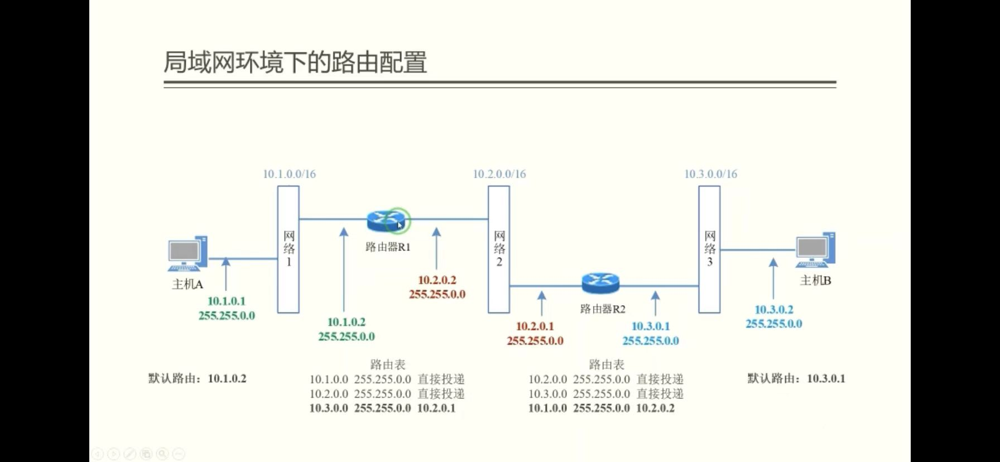
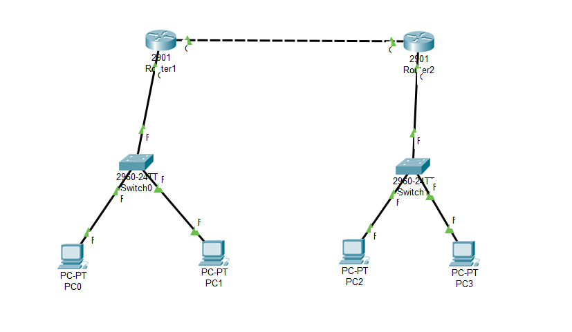
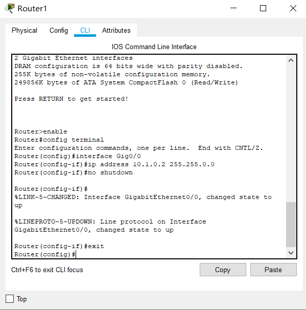
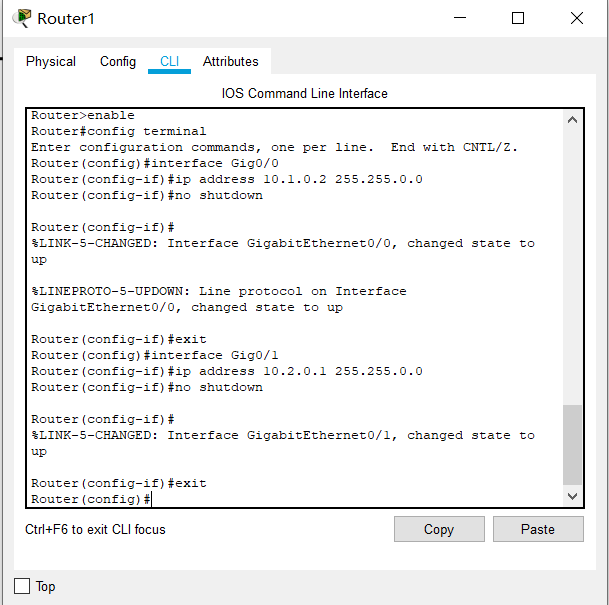
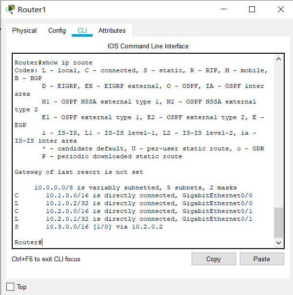
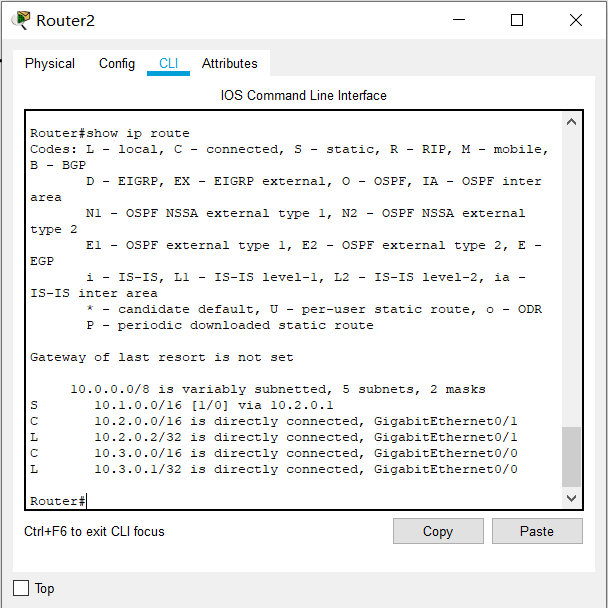
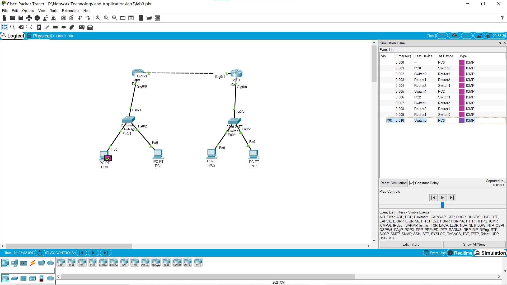
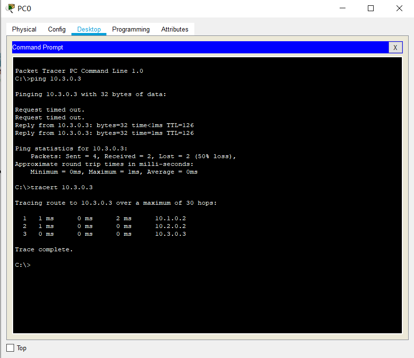
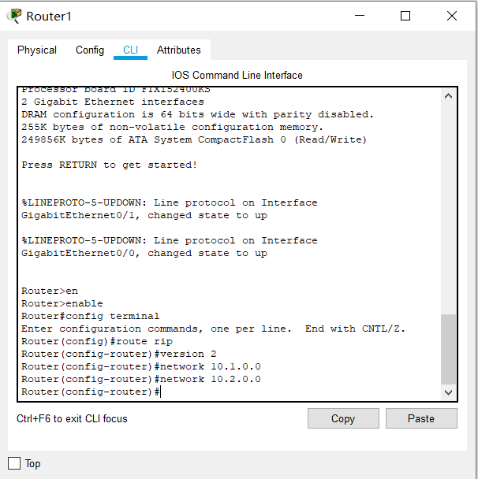
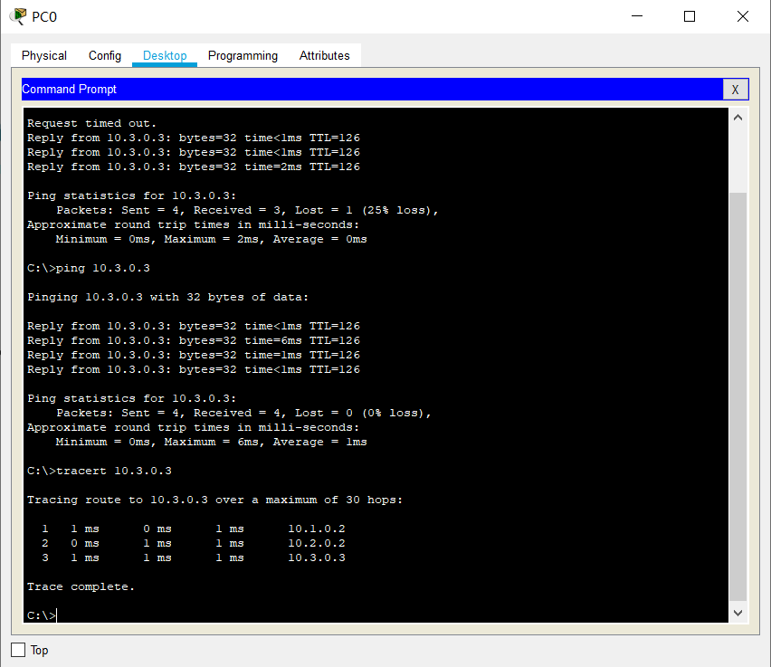

网络技术与应用实验报告（四）
==================================

-----

>专业：计算机科学与技术
>学号：2011188
>姓名：邵琦


<!-- @import "[TOC]" {cmd="toc" depthFrom=1 depthTo=6 orderedList=false} -->

<!-- code_chunk_output -->

- [一、实验要求](#一-实验要求)
  - [1.1 实体环境下互联网组网与路由器配置](#11-实体环境下互联网组网与路由器配置)
  - [1.2 仿真环境下的互联网组网与路由器配置](#12-仿真环境下的互联网组网与路由器配置)
- [二、实体环境下互联网组网与路由器配置](#二-实体环境下互联网组网与路由器配置)
  - [前期准备](#前期准备)
  - [实验过程](#实验过程)
- [三、仿真环境下的互联网组网与路由器配置](#三-仿真环境下的互联网组网与路由器配置)
  - [3.1 静态路由](#31-静态路由)
    - [前期准备](#前期准备-1)
    - [实验过程](#实验过程-1)
    - [实验结果](#实验结果)
  - [3.2 动态路由](#32-动态路由)
    - [前期准备](#前期准备-2)
    - [实验过程](#实验过程-2)
    - [实验结果](#实验结果-1)
- [四、实验总结](#四-实验总结)

<!-- /code_chunk_output -->


# 一、实验要求

## 1.1 实体环境下互联网组网与路由器配置

在实体环境下完成互联网组网与路由器配置，要求如下：
（1）在机房实验室环境下，通过将局域网划分为不同子网，用多IP主机作为路由器，组建互联网。

（2）在命令行方式下，按照静态路由方式，配置路由器和主机，测试互联网的连通性。

## 1.2 仿真环境下的互联网组网与路由器配置

在仿真环境下完成互联网组网与路由器配置，要求如下：
（1）学习路由器的配置方法和配置命令。

（2）参考实体实验，组建由多个路由器组成的互联网。物理网络可以由集线器、交换机构成。

（3）按照静态路由方式配置路由器和主机，测试互联网的连通性。

（4）利用动态路由方式配置路由器和主机，测试互联网的连通性。

（5）在仿真环境的“模拟”方式中观察数据包在互联网中的传递过程，并进行分析。

# 二、实体环境下互联网组网与路由器配置

## 前期准备

在机房使用四台电脑完成实验，其中两台作为路由器，另外两台作为主机。



## 实验过程

首先，为两台作为主机的电脑配置IP和默认网关。


之后，为两台作为路由器的电脑配置单网卡多IP。


在路由器上配置对应转发表。


相应的命令：

```
route PRINT:可以看到当前路由表信息
route ADD:目标网络MASK目标网络掩码，下一跳IP地址添加路由表表项
route CHANGE:目标网络MASK目标网络掩码，下一跳IP地址修改路由表表项
route DELETE:目标网络删除路由表
```

之后还需要开启路由器的转发服务和关闭所有的四台主机的防⽕墙服务，⾸先开启两台路由器的转发服务，再关闭防火墙。


最终使用ping命令以及tracert命令，跟踪路由转发过程。


# 三、仿真环境下的互联网组网与路由器配置

## 3.1 静态路由

### 前期准备

配置如下图所示：



ip地址分配为：

PC或端口号|IPv4 Address|Subnet Mask|网关
-|-|-|-
PC0|10.1.0.1| 255.255.0.0 |10.1.0.2
PC1|10.1.0.3| 255.255.0.0 |10.1.0.2
PC2|10.3.0.3| 255.255.0.0 |10.3.0.1
PC3|10.3.0.2| 255.255.0.0 |10.3.0.1
Router1 Gig0/0|10.1.0.2| 255.255.0.0
Router1 Gig0/1|10.2.0.1| 255.255.0.0
Router2 Gig0/0|10.3.0.1| 255.255.0.0
Router2 Gig0/1|10.2.0.2| 255.255.0.0

### 实验过程

配置四个终端的IP和默认网关

打开路由器的CLI界面，使用下图的指令分别配置两个路由器的接口Gig0/0、Gig0/1。





使⽤指令show ip route查看表项。





### 实验结果

模拟仿真结果如图所示，数据由router1发送给了router2，完成了数据包在互联网中的传递。



使⽤ping命令以及⽤tracert命令追踪数据流，结果如下所示。



## 3.2 动态路由

### 前期准备

配置如下图所示：


ip地址分配为：

PC或端口号|IPv4 Address|Subnet Mask|网关
-|-|-|-
PC0|10.1.0.1| 255.255.0.0 |10.1.0.2
PC1|10.1.0.3| 255.255.0.0 |10.1.0.2
PC2|10.3.0.3| 255.255.0.0 |10.3.0.1
PC3|10.3.0.2| 255.255.0.0 |10.3.0.1
Router1 Gig0/0|10.1.0.2| 255.255.0.0
Router1 Gig0/1|10.2.0.1| 255.255.0.0
Router2 Gig0/0|10.3.0.1| 255.255.0.0
Router2 Gig0/1|10.2.0.2| 255.255.0.0

### 实验过程

与静态路由类似，注意的是需要配置RIP，首先在两台路由器下进⼊RIP配置模式，其版本为可以处理⼦⽹编制为version 2版本，并为其配置直接相连的⽹络，最后在两台路由器下的配置界⾯如下图所示：



模拟仿真结果与静态路由类似，本处不再赘述。

### 实验结果

使⽤ping命令以及⽤tracert命令追踪数据流，结果如下所示。



# 四、实验总结

通过本次实验，我进一步了解了互联网组网与路由器的相关概念知识，学习了实体环境下与仿真环境下的互联网组网与路由器配置，对于网络技术有了更深刻的理解与认识。