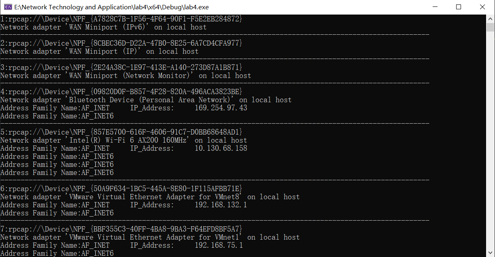
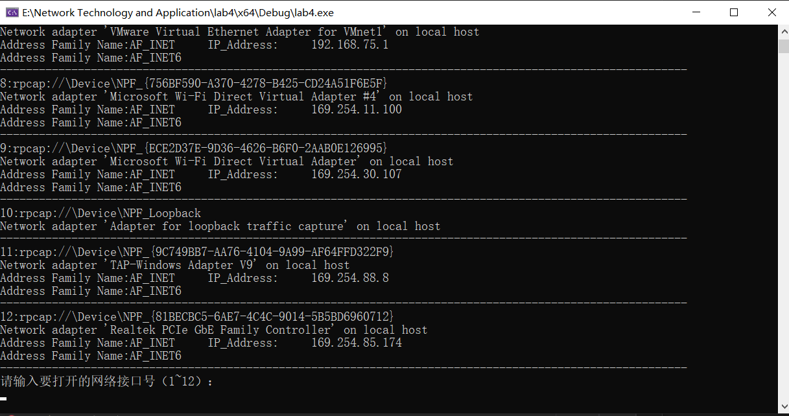
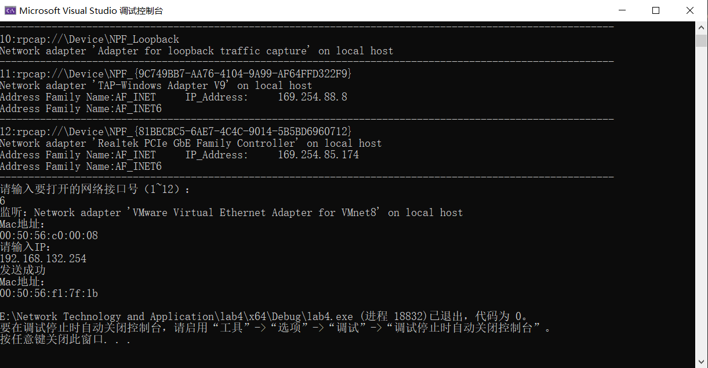
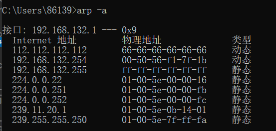

网络技术与应用实验报告（四）
==================================

-----

>专业：计算机科学与技术
>学号：2011188
>姓名：邵琦


<!-- @import "[TOC]" {cmd="toc" depthFrom=1 depthTo=6 orderedList=false} -->

<!-- code_chunk_output -->

- [一、实验要求](#一-实验要求)
- [二、实验步骤](#二-实验步骤)
- [三、代码分析](#三-代码分析)
  - [1. 报文格式](#1-报文格式)
  - [2. 获取设备列表](#2-获取设备列表)
  - [3. 打印网卡信息和对应IP](#3-打印网卡信息和对应ip)
  - [4. 打开网络接口卡](#4-打开网络接口卡)
  - [5. 获取远程网卡的MAC地址](#5-获取远程网卡的mac地址)
    - [请求本地网卡的MAC地址，将本机IP和MAC填入报文](#请求本地网卡的mac地址将本机ip和mac填入报文)
    - [重新发送ARP请求](#重新发送arp请求)
- [四、实验结果](#四-实验结果)
  - [打印网卡信息和对应IP](#打印网卡信息和对应ip)
  - [输入IP地址与获取的MAC地址对应关系](#输入ip地址与获取的mac地址对应关系)
- [五、实验难点](#五-实验难点)
  - [获取远程网卡的MAC地址](#获取远程网卡的mac地址)
- [六、实验总结](#六-实验总结)

<!-- /code_chunk_output -->


# 一、实验要求

通过编程获取IP地址与MAC地址的对应关系实验，要求如下：

（1）在IP数据报捕获与分析编程实验的基础上，学习WinPcap的数据包发送方法。

（2）通过Npcap编程，获取IP地址与MAC地址的映射关系。

（3）程序要具有输入IP地址，显示输入IP地址与获取的MAC地址对应关系界面。界面可以是命令行界面，也可以是图形界面，但应以简单明了的方式在屏幕上显示。

（4）编写的程序应结构清晰，具有较好的可读性。

# 二、实验步骤

本次实验需要获取主机网卡中对应IP的MAC地址，可以利用ARP请求方法，过程如下:

1. 获取网络接口卡列表，选择需要捕获MAC地址的网卡A（或选择对应的IP）

2. 伪造ARP请求报文S

3. 用网卡A发送报文S'

4. 对网卡A进行流量监听，筛选其中的ARP报文，捕获网卡A的ARP响应报文，在响应报文的帧首部源MAC地址部分可以看到发送该ARP响应的网卡对应的MAC地址

# 三、代码分析

## 1. 报文格式

首先需要将捕获的的结构体强制转化成我们所需要的格式⸺即标准数据报所具有的格式，因为其是按字节划分的，所以需要⽤到pack()函数，打包过程如以下代码：

```c++
#pragma pack(1)//字节对齐方式

typedef struct FrameHeader_t {		//帧首部
	BYTE DesMAC[6];//目的地址
	BYTE SrcMAC[6];//源地址
	WORD FrameType;//帧类型
}FrameHeader_t;

typedef struct ARPFrame_t {//IP首部
	FrameHeader_t FrameHeader;
	WORD HardwareType;//硬件类型
	WORD ProtocolType;//协议类型
	BYTE HLen;//硬件地址长度
	BYTE PLen;//协议地址长度
	WORD Operation;//操作类型
	BYTE SendHa[6];//发送方MAC地址
	DWORD SendIP;//发送方IP地址
	BYTE RecvHa[6];//接收方MAC地址
	DWORD RecvIP;//接收方IP地址
}ARPFrame_t;
# pragma pack()
```

## 2. 获取设备列表

定义完后，获取设备列表，先定义接⼝指针、接口数量和⼀个错误信息缓冲区等，然后利⽤pcap_findalldevs_ex函数来获取计算机上的⽹络接⼝设备的列表，如果返回值为-1⸺即出现异常的话，则会显示异常信息并结束进程。

```c++
pcap_if_t* alldevs;//指向设备链表首部的指针
	pcap_if_t* d;
	char errbuf[PCAP_ERRBUF_SIZE];	//错误信息缓冲区
	int num = 0;//接口数量
	int n;
	char* ip = new char[20];
	char* ip1 = new char[20];
	//获得本机的设备列表
	if (pcap_findalldevs_ex(PCAP_SRC_IF_STRING, 	//获取本机的接口设备
		NULL,			       //无需认证
		&alldevs, 		       //指向设备列表首部
		errbuf			      //出错信息保存缓存区
	) == -1)
	{
		//错误处理
		cout << "获取本机设备错误" << errbuf << endl;
		pcap_freealldevs(alldevs);
		return 0;
	}
```

## 3. 打印网卡信息和对应IP

通过遍历每个网络接口，利用d->name获取该网络接口设备的名字以及利用d->description获取该网络接口设备的描述信息，接着获取该网络接口设备的ip地址信息。

```c++
//显示接口列表
	for (d = alldevs; d != NULL; d = d->next)
	{
		num++;
		cout << dec << num << ":" << d->name << endl;//利用d->name获取该网络接口设备的名字
		if (d->description != NULL)//利用d->description获取该网络接口设备的描述信息
		{
			cout << d->description << endl;
		}
		else
		{
			cout << "无描述信息" << endl;
		}
		//获取该网络接口设备的ip地址信息
		pcap_addr_t* a; // 网络适配器的地址
		for (a = d->addresses; a != NULL; a = a->next)
		{
			switch (a->addr->sa_family)//sa_family代表了地址的类型
			{
			case AF_INET://IPV4
				printf("Address Family Name:AF_INET\t");
				if (a->addr != NULL)
				{
					//strcpy(ip, inet_ntoa(((struct sockaddr_in*)a->addr)->sin_addr));
					printf("%s\t%s\n", "IP_Address:", inet_ntoa(((struct sockaddr_in*)a->addr)->sin_addr));
				}
				break;
			case AF_INET6://IPV6
				cout << "Address Family Name:AF_INET6" << endl;
				break;
			default:
				break;
			}
		}
		cout << "----------------------------------------------------------------------------------------------------------" << endl;
	}
	if (num == 0)
	{
		cout << "无可用接口" << endl;
		return 0;
	}
```

## 4. 打开网络接口卡

通过指针遍历来获取并显示接口列表。然后由⽤户选择想要监听的网络接口号，先对其选择的数字做合法性检测，并跳转到此设备出进⾏数据报的监听，如果监听成功则开始返回⼿动设置输出的信息，如果失败则会显示错误信息并结束进程。

```c++
	cout << "请输入要打开的网络接口号" << "（1~" << num << "）：" << endl;
	num = 0;
	cin >> n;
	// 跳转到选中的网络接口号
	for (d = alldevs; num < (n - 1); num++)
	{
		d = d->next;
	}
	strcpy(ip, inet_ntoa(((struct sockaddr_in*)(d->addresses)->addr)->sin_addr));
	pcap_t* adhandle;
	adhandle = pcap_open(d->name,		//设备名
		65536,		//要捕获的数据包的部分
		PCAP_OPENFLAG_PROMISCUOUS,		//混杂模式
		1000,			//超时时间
		NULL,		//远程机器验证
		errbuf		//错误缓冲池
	);
	if (adhandle == NULL)
	{
		cout << "产生错误，无法打开设备" << endl;
		pcap_freealldevs(alldevs);
		return 0;
	}
	else
	{
		cout << "监听：" << d->description << endl;
		pcap_freealldevs(alldevs);
	}
```

## 5. 获取远程网卡的MAC地址

### 请求本地网卡的MAC地址，将本机IP和MAC填入报文

首先设置ARP帧的内容，将将APRFrame.FrameHeader.DesMAC设置为广播地址，APRFrame.FrameHeader.SrcMAC设置为本机网卡的MAC地址，ARPFrame.SendHa设置为本机网卡的MAC地址，ARPFrame.SendIP设置为本机网卡上绑定的IP地址，ARPFrame.RecvHa设置为0，ARPFrame.RecvIP设置为请求的IP地址。设置完成后，用网卡发送ARPFrame中的内容，报文长度为sizeof(ARPFrame_t)，如果发送成功，返回0。之后便开始捕获，如果帧类型为ARP并且操作为ARP应答，则可以输出MAC地址。

```c++
//设置ARP帧的内容
	//将APRFrame.FrameHeader.DesMAC设置为广播地址
	for (int i = 0; i < 6; i++)
	{
		ARPFrame.FrameHeader.DesMAC[i] = 0xff;
	}
	//将APRFrame.FrameHeader.SrcMAC设置为本机网卡的MAC地址
	for (int i = 0; i < 6; i++)
	{
		ARPFrame.FrameHeader.SrcMAC[i] = 0x66;
	}
	ARPFrame.FrameHeader.FrameType = htons(0x0806);// 帧类型为ARP
	ARPFrame.HardwareType = htons(0x0001);//硬件类型为以太网
	ARPFrame.ProtocolType = htons(0x0800);//协议类型为IP
	ARPFrame.HLen = 6;//硬件地址长度为6
	ARPFrame.PLen = 4;//协议地址长为4
	ARPFrame.Operation = htons(0x0001);//操作为ARP请求
	//将ARPFrame.SendHa设置为本机网卡的MAC地址
	for (int i = 0; i < 6; i++)
	{
		ARPFrame.SendHa[i] = 0x66;
	}
	//将ARPFrame.SendIP设置为本机网卡上绑定的IP地址
	ARPFrame.SendIP = inet_addr("112.112.112.112");
	//将ARPFrame.RecvHa设置为0
	for (int i = 0; i < 6; i++)
	{
		ARPFrame.RecvHa[i] = 0x00;//表示目的地址未知
	}
	//将ARPFrame.RecvIP设置为请求的IP地址
	ARPFrame.RecvIP = inet_addr(ip);
	//用网卡发送ARPFrame中的内容，报文长度为sizeof(ARPFrame_t)，如果发送成功，返回0
	if (pcap_sendpacket(adhandle, (u_char*)&ARPFrame, sizeof(ARPFrame_t)) != 0)
	{
		cout << "发送失败，退出程序" << endl;
		return -1;
	}
	// 声明即将捕获的ARP帧
	ARPFrame_t* IPPacket;
	// 开始进行捕获
	while (1)//可能会有多条消息
	{
		pcap_pkthdr* pkt_header;
		const u_char* pkt_data;
		int rtn = pcap_next_ex(adhandle, &pkt_header, &pkt_data);
		if (rtn == 1)
		{
			IPPacket = (ARPFrame_t*)pkt_data;
			if ((ntohs(IPPacket->FrameHeader.FrameType) == 0x0806) && (ntohs(IPPacket->Operation) == 0x0002))//如果帧类型为ARP并且操作为ARP应答
			{
				printf("Mac地址：\n");
				printf("%02x:%02x:%02x:%02x:%02x:%02x\n",
					IPPacket->FrameHeader.SrcMAC[0],
					IPPacket->FrameHeader.SrcMAC[1],
					IPPacket->FrameHeader.SrcMAC[2],
					IPPacket->FrameHeader.SrcMAC[3],
					IPPacket->FrameHeader.SrcMAC[4],
					IPPacket->FrameHeader.SrcMAC[5]
				);
				break;
			}
		}
	}
```

### 重新发送ARP请求

类似于上一步，这一步最关键的便是将ARPFrame.RecvIP设置为新请求的IP地址。

```c++
	cout << "请输入IP：" << endl;
	cin >> ip1;
	ARPFrame.RecvIP = inet_addr(ip1);
	if (pcap_sendpacket(adhandle, (u_char*)&ARPFrame, sizeof(ARPFrame_t)) != 0)
	{
		cout << "发送失败，退出程序" << endl;
		return -1;
	}
	else
	{
		cout << "发送成功" << endl;
	}
	ARPFrame_t* IPPacket1;
	while (1)//可能会有多条消息
	{
		pcap_pkthdr* pkt_header1;
		const u_char* pkt_data1;
		int rtnNew = pcap_next_ex(adhandle, &pkt_header1, &pkt_data1);
		if (rtnNew == 1)
		{
			IPPacket1 = (ARPFrame_t*)pkt_data1;
			if ((ntohs(IPPacket1->FrameHeader.FrameType) == 0x0806) && (ntohs(IPPacket1->Operation) == 0x0002))//如果帧类型为ARP并且操作为ARP应答
			{
				printf("Mac地址：\n");
				printf("%02x:%02x:%02x:%02x:%02x:%02x\n",
					IPPacket1->FrameHeader.SrcMAC[0],
					IPPacket1->FrameHeader.SrcMAC[1],
					IPPacket1->FrameHeader.SrcMAC[2],
					IPPacket1->FrameHeader.SrcMAC[3],
					IPPacket1->FrameHeader.SrcMAC[4],
					IPPacket1->FrameHeader.SrcMAC[5]
				);
				break;
			}
		}
	}
```

# 四、实验结果

## 打印网卡信息和对应IP





## 输入IP地址与获取的MAC地址对应关系

通过查询，答案正确。





# 五、实验难点

## 获取远程网卡的MAC地址

这是本次实验的关键部分，也是相对最难的部分，本部分不知道该如何下手，之后经过看书与查阅资料得知，可有两种方法获取MAC地址，为：

1. 封装ARP请求时使用本机网卡的IP和MAC地址

（1）先利用上述方法请求本地网卡的MAC地址，将本机IP和MAC填入报文；

（2）再重新发送ARP请求

2. 直接使用伪造的IP和MAC地址进行发送

虽然本机网卡发送时需用的是虚拟MAC和IP地址，但是网关接收到组建的ARP请求后会由网关发出一个ARP请求，找到本机发送网卡的真实IP和MAC地址，从而进一步获取远程主机的MAC。

# 六、实验总结

通过本次实验，我进一步了解了IP地址与MAC地址相关知识以及相关对应关系，学会了通过ARP报文来获取IP地址与MAC地址对应关系，对于网络编程有了更深刻的认识。