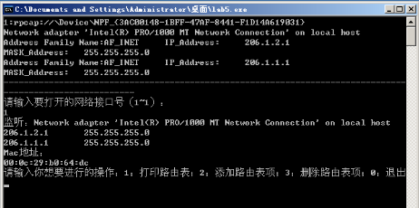
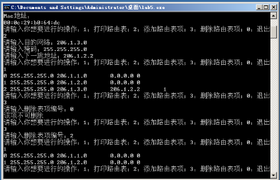

网络技术与应用实验报告（八）
==================================

-----

>专业：计算机科学与技术
>学号：2011188
>姓名：邵琦


<!-- @import "[TOC]" {cmd="toc" depthFrom=1 depthTo=6 orderedList=false} -->

<!-- code_chunk_output -->

- [网络技术与应用实验报告（八）](#网络技术与应用实验报告八)
- [一、实验要求](#一实验要求)
- [二、实验步骤](#二实验步骤)
- [三、代码分析](#三代码分析)
	- [宏定义](#宏定义)
	- [报文格式](#报文格式)
	- [存储结构](#存储结构)
		- [路由表表项](#路由表表项)
		- [路由表](#路由表)
		- [ARP表](#arp表)
		- [日志](#日志)
	- [主要函数](#主要函数)
		- [GetOtherMac（获取MAC地址）](#getothermac获取mac地址)
		- [设置与检验校验和](#设置与检验校验和)
		- [接收和处理线程函数](#接收和处理线程函数)
		- [消息转发函数](#消息转发函数)
	- [主函数](#主函数)
		- [获取设备列表](#获取设备列表)
		- [打印网卡信息和对应IP](#打印网卡信息和对应ip)
		- [打开网络接口卡](#打开网络接口卡)
		- [获取IP对应的MAC地址](#获取ip对应的mac地址)
		- [循环中进行相关操作](#循环中进行相关操作)
- [四、实验结果](#四实验结果)
- [五、实验难点](#五实验难点)
- [六、实验总结](#六实验总结)

<!-- /code_chunk_output -->


# 一、实验要求

实验5：简单路由器程序的设计

简单路由器程序设计实验的具体要求为：

（1）设计和实现一个路由器程序，要求完成的路由器程序能和现有的路由器产品（如思科路由器、华为路由器、微软的路由器等）进行协同工作。

（2）程序可以仅实现IP数据报的获取、选路、投递等路由器要求的基本功能。可以忽略分片处理、选项处理、动态路由表生成等功能。

（3）需要给出路由表的手工插入、删除方法。

（4）需要给出路由器的工作日志，显示数据报获取和转发过程。

（5）完成的程序须通过现场测试，并在班（或小组）中展示和报告自己的设计思路、开发和实现过程、测试方法和过程。

# 二、实验步骤

1. 首先我们获取网卡列表以及对应信息（名字、描述信息以及IP等），之后打开网卡，获取本机MAC地址，并且初始化路由表，在路由表中添加直接投递的表项，之后进入循环，开始实验内容（打印路由表、手动添加路由表项、删除路由表项、退出等）。
2. 之后在自己创建的线程中，进行接收信息以及转发信息。在接收消息中，筛选IP类型的消息，丢弃ARP类型。获取消息的MAC地址，如果消息的目的MAC地址不是本机，则丢弃，如果目的MAC地址以及目的IP地址全部指向自己，则接收，如果目的MAC地址是本机，但IP地址不是本机，则转发。之后查找路由表的对应的下一步IP，若没找到，则丢弃；若找到，则进行下一步。之后查看ARP表，看是否有下一跳IP地址的MAC地址，若没有，则发送ARP请求获取MAC地址，若有，直接返回。
3. 之后进行组装报文，对于接收到的信息进行修改，将SrcMAC变为本机的MAC，将DesMAC变为下一跳的MAC。若TTL=0，则返回报文，不转发。若TTL>0，则-1，重新计算校验和。
4. 最后发送消息。重复线程的循环。

# 三、代码分析

## 宏定义

首先在程序开头定义所需库以及一些宏定义。

```c++
#define _CRT_SECURE_NO_WARNINGS
#define _WINSOCK_DEPRECATED_NO_WARNINGS
#include <Winsock2.h>
//#include<iostream>
#include "pcap.h"
#include "stdio.h"
//#include<time.h>
#include <string.h>
#include "log.h"//日志

#pragma comment(lib,"ws2_32.lib")
#pragma comment(lib, "packet.lib")
#pragma comment(lib,"wpcap.lib")
#pragma comment(lib,"wsock32.lib")
#pragma warning(disable : 4996)

char ip[10][20];
char mask[10][20];
BYTE selfmac[6];
pcap_t* adhandle;
//多线程
HANDLE hThread;
DWORD dwThreadId;
int n;
int Routerlog::num = 0;
Routerlog Routerlog::diary[50] = {};
FILE* Routerlog::fp = nullptr;
Routerlog LT;
BYTE broadcast[6] = { 0xff,0xff,0xff,0xff,0xff,0xff };
```

## 报文格式

之后，我们定义一些报文格式，这些都是程序之后所需。

报文首部、IP报文首部、ARP报文格式、数据包以及ICMP报文格式。

```c++
#pragma pack(1)//字节对齐方式

typedef struct FrameHeader_t {		//帧首部
	BYTE DesMAC[6];//目的地址
	BYTE SrcMAC[6];//源地址
	WORD FrameType;//帧类型
}FrameHeader_t;

typedef struct IPHeader_t {		//IP首部
	BYTE Ver_HLen;//IP协议版本和IP首部长度：高4位为版本，低4位为首部的长度
	BYTE TOS;//服务类型
	WORD TotalLen;//总长度
	WORD ID;//标识
	WORD Flag_Segment;//标志 片偏移
	BYTE TTL;//生存周期
	BYTE Protocol;//协议
	WORD Checksum;//头部校验和
	u_int SrcIP;//源IP
	u_int DstIP;//目的IP
}IPHeader_t;

typedef struct ARPFrame_t {//IP首部
	FrameHeader_t FrameHeader;
	WORD HardwareType;//硬件类型
	WORD ProtocolType;//协议类型
	BYTE HLen;//硬件地址长度
	BYTE PLen;//协议地址长度
	WORD Operation;//操作类型
	BYTE SendHa[6];//发送方MAC地址
	DWORD SendIP;//发送方IP地址
	BYTE RecvHa[6];//接收方MAC地址
	DWORD RecvIP;//接收方IP地址
}ARPFrame_t;

typedef struct Data_t {		//数据包
	FrameHeader_t FrameHeader;
	IPHeader_t IPHeader;
}Data_t;

typedef struct ICMP {//ICMP报文
	FrameHeader_t FrameHeader;
	IPHeader_t IPHeader;
	char buf[0x80];
}ICMP_t;

#pragma pack()//恢复缺省对齐方式
```

## 存储结构

### 路由表表项

定义路由表表项，一个表项包含掩码、目的网络、下一跳IP，以及表项类型等。路由表表项采用链表的形式存储。并且定义Print函数，用于打印表项内容：掩码、目的网络、下一跳IP、类型。

```c++
#pragma pack(1)
class RouterItem//路由表表项
{
public:
	DWORD mask;//掩码
	DWORD net;//目的网络
	DWORD nextip;//下一跳
	BYTE nextmac[6];
	int index;//第几条
	int type;//0为直接连接，1为用户添加
	RouterItem* nextitem;//采用链表形式存储
	RouterItem()
	{
		memset(this, 0, sizeof(*this));//全部初始化为0
	}
	void PrintItem()//打印表项内容：掩码、目的网络、下一跳IP、类型
	{
		in_addr addr;
		printf("%d ", index);
		addr.s_addr = mask;
		char* temp = inet_ntoa(addr);
		printf("%s\t", temp);
		addr.s_addr = net;
		temp = inet_ntoa(addr);
		printf("%s\t", temp);
		addr.s_addr = nextip;
		temp = inet_ntoa(addr);
		printf("%s\t", temp);
		printf("%d\n", type);
	}
};
#pragma pack()
```

### 路由表

路由表内包含了多个路由表项（以链表形式存储）。开始进行初始化，添加直接相连的网络。定义路由表的添加、删除、打印以及查找函数。在添加函数中，首先判断路由表项类型，若为0，则直接投递，加入路由表；若为1，则为手动添加，则按照掩码由长到短进行添加。删除函数中，首先判断路由表类型，若为0，则不可删除；若为1，则直接删除。打印函数中，遍历路由表，依次删除路由表中的路由表项的信息。查找函数中，遍历路由表，查找最长前缀，返回下一跳的ip。

```c++
#pragma pack(1)
class RouterTable//路由表
{
public:
	RouterItem* head, * tail;
	int num;//条数
	RouterTable()//初始化，添加直接相连的网络
	{
		head = new RouterItem;
		tail = new RouterItem;
		head->nextitem = tail;
		num = 0;
		for (int i = 0; i < 2; i++)
		{
			RouterItem* temp = new RouterItem;
			temp->net = (inet_addr(ip[i])) & (inet_addr(mask[i]));//本机网卡的ip和掩码进行按位与即为所在网络
			temp->mask = inet_addr(mask[i]);
			temp->type = 0;//0表示直接连接，不可删除
			this->RouterAdd(temp);
		}
	}
	void RouterAdd(RouterItem* a)//路由表的添加
	{
		RouterItem* pointer;
		if (!a->type)
		{
			a->nextitem = head->nextitem;
			head->nextitem = a;
			a->type = 0;
		}
		else//按照掩码由长至短找到合适的位置
		{
			for (pointer = head->nextitem; pointer != tail && pointer->nextitem != tail; pointer = pointer->nextitem)
			{
				if (a->mask < pointer->mask && a->mask >= pointer->nextitem->mask || pointer->nextitem == tail)
				{
					break;
				}
			}
			a->nextitem = pointer->nextitem;
			pointer->nextitem = a;
		}
		RouterItem* p = head->nextitem;
		for (int i = 0; p != tail; p = p->nextitem, i++)
		{
			p->index = i;
		}
		num++;
	}
	void RouterRemove(int index)//路由表的删除
	{
		for (RouterItem* t = head; t->nextitem != tail; t = t->nextitem)
		{
			if (t->nextitem->index == index)
			{
				if (t->nextitem->type == 0)
				{
					printf("该项不可删除\n");
					return;
				}
				else
				{
					t->nextitem = t->nextitem->nextitem;
					return;
				}
			}
		}
		printf("无该表项\n");
	}
	void print()
	{
		for (RouterItem* p = head->nextitem; p != tail; p = p->nextitem)
		{
			p->PrintItem();
		}
	}
	DWORD RouterFind(DWORD ip)//查找最长前缀，返回下一跳的ip
	{
		for (RouterItem* t = head->nextitem; t != tail; t = t->nextitem)
		{
			if ((t->mask & ip) == t->net)
			{
				return t->nextip;
			}
		}
		return -1;
	}
};
#pragma pack()
```

### ARP表

为减少发送ARP请求的次数，将IP和MAC的对应关系存储在一张表里，在实际情况中需要设置表项的生命周期，防止一段时间后个别表项IP和MAC出现不对应的情况，本次实验较为简单，故没有设置。

在ARP表中，存储了IP以及MAC之间的对应关系，定义了插入以及查找函数。在插入函数中，使用GetOtherMac函数获取IP地址对应的MAC地址。在查找函数中，遍历ARP表进行查找。

```c++
#pragma pack(1)
class ArpTable//ARP表（将IP和MAC的对应关系存储在一张表里）
{
public:
	DWORD ip;
	BYTE mac[6];
	static int num;
	static void InsertArp(DWORD ip, BYTE mac[6])
	{
		arptable[num].ip = ip;
		GetOtherMac(ip, arptable[num].mac);
		memcpy(mac, arptable[num].mac, 6);
		num++;
	}
	static int FindArp(DWORD ip, BYTE mac[6])
	{
		memset(mac, 0, 6);
		for (int i = 0; i < num; i++)
		{
			if (ip == arptable[i].ip)
			{
				memcpy(mac, arptable[i].mac, 6);
				return 1;
			}
		}
		return 0;
	}
}arptable[50];
#pragma pack()

int ArpTable::num = 0;
```

### 日志

本次实验需要输出路由器的工作日志。如下所示。

```c++
class arpitem
{
public:
	DWORD ip;
	BYTE mac[6];
};

class ipitem
{
public:
	DWORD sip, dip;
	BYTE smac[6], dmac[6];
};

class Routerlog //日志
{
public:
	int index;//索引
	char type[5];//类型（arp ip）
	ipitem ip;
	arpitem arp;
	Routerlog()
	{
		fp = fopen("log.txt", "a+");//文件以及打开方式
	}
	~Routerlog()
	{
		fclose(fp);
	}
	static int num;
	static Routerlog diary[50];
	static FILE* fp;
	static void WritelogARP(ARPFrame_t* t)
	{
		fprintf(fp, "ARP\t");
		in_addr addr;
		addr.s_addr = t->SendIP;
		char* temp = inet_ntoa(addr);
		fprintf(fp, "IP:\t");
		fprintf(fp, "%s\t", temp);
		fprintf(fp, "MAC:\t");
		for (int i = 0; i < 6; i++)
		{
			fprintf(fp, "%02x:", t->SendHa[i]);
		}
		fprintf(fp, "\n");
		//printf("end\n");
	}
	static void WritelogIP(const char* a, Data_t* t)
	{
		fprintf(fp, "IP\t");
		fprintf(fp, a);
		fprintf(fp, "\t");
		in_addr addr;
		addr.s_addr = t->IPHeader.SrcIP;
		char* temp = inet_ntoa(addr);
		fprintf(fp, "源IP：\t");
		fprintf(fp, "%s\t", temp);
		fprintf(fp, "目的IP：\t");
		addr.s_addr = t->IPHeader.DstIP;
		fprintf(fp, "%s\t", temp);
		fprintf(fp, "源MAC：\t");
		for (int i = 0; i < 6; i++)
			fprintf(fp, "%02x:", t->FrameHeader.SrcMAC[i]);
		fprintf(fp, "目的MAC：\t");
		for (int i = 0; i < 6; i++)
			fprintf(fp, "%02x:", t->FrameHeader.DesMAC[i]);
		fprintf(fp, "\n");
		//printf("end\n");
	}
	static void print()
	{
		for (int i = 0; i < num; i++)
		{
			printf("%d ", diary[i].index);
			printf("%s\t ", diary[i].type);
			if (strcmp(diary[i].type, "ARP") == 0)
			{
				in_addr addr;
				addr.s_addr = diary[i].arp.ip;
				char* temp = inet_ntoa(addr);
				printf("%s\t", temp);
				for (int i = 0; i < 6; i++)
				{
					printf("%02x.", diary[i].arp.mac[i]);
				}
				//fprintf(fp, "/n");
				//printf("end\n");
			}
			else if (strcmp(diary[i].type, "IP") == 0)
			{
				in_addr addr;
				addr.s_addr = diary[i].ip.sip;
				char* temp = inet_ntoa(addr);
				printf("源IP：%s\t", temp);
				addr.s_addr = diary[i].ip.dip;
				temp = inet_ntoa(addr);
				printf("目的IP：%s\t", temp);
				printf("源MAC: ");
				for (int i = 0; i < 6; i++)
				{
					printf("%02x.", diary[i].ip.smac[i]);
				}
				printf("目的MAC: ");
				for (int i = 0; i < 6; i++)
				{
					printf("%02x.", diary[i].ip.dmac[i]);
				}
				//fprintf(fp, "/n");
				//printf("end\n");
			}
		}
	}
};
```

## 主要函数

### GetOtherMac（获取MAC地址）

与获取本机MAC地址类似，后面会介绍，本处不再赘述。区别在于将ARPFrame.RecvIP设置为新请求的IP地址。

```c++
void GetOtherMac(DWORD ip0, BYTE mac[])
{
	memset(mac, 0, sizeof(mac));
	ARPFrame_t ARPFrame;
	//将APRFrame.FrameHeader.DesMAC设置为广播地址
	for (int i = 0; i < 6; i++)
		ARPFrame.FrameHeader.DesMAC[i] = 0xff;
	//将APRFrame.FrameHeader.SrcMAC设置为本机网卡的MAC地址
	for (int i = 0; i < 6; i++)
	{
		ARPFrame.FrameHeader.SrcMAC[i] = selfmac[i];
		ARPFrame.SendHa[i] = selfmac[i];
	}
	ARPFrame.FrameHeader.FrameType = htons(0x0806);//帧类型为ARP
	ARPFrame.HardwareType = htons(0x0001);//硬件类型为以太网
	ARPFrame.ProtocolType = htons(0x0800);//协议类型为IP
	ARPFrame.HLen = 6;//硬件地址长度为6
	ARPFrame.PLen = 4;//协议地址长为4
	ARPFrame.Operation = htons(0x0001);//操作为ARP请求
	//将ARPFrame.SendIP设置为本机网卡上绑定的IP地址
	ARPFrame.SendIP = inet_addr(ip[0]);
	//将ARPFrame.RecvHa设置为0
	for (int i = 0; i < 6; i++)
	{
		ARPFrame.RecvHa[i] = 0;
	}
	//将ARPFrame.RecvIP设置为请求的IP地址
	ARPFrame.RecvIP = ip0;
	if (adhandle == nullptr)
	{
		printf("网卡接口打开错误\n");
	}
	else
	{
		if (pcap_sendpacket(adhandle, (u_char*)&ARPFrame, sizeof(ARPFrame_t)) != 0)
		{
			//发送错误处理
			printf("发送错误\n");
			return;
		}
		else
		{
			//发送成功
			while (1)
			{
				pcap_pkthdr* pkt_header;
				const u_char* pkt_data;
				int rtn = pcap_next_ex(adhandle, &pkt_header, &pkt_data);
				//pcap_sendpacket(ahandle, (u_char*)&ARPFrame, sizeof(ARPFrame_t));
				if (rtn == 1)
				{
					ARPFrame_t* IPPacket = (ARPFrame_t*)pkt_data;
					if (ntohs(IPPacket->FrameHeader.FrameType) == 0x0806)
					{//输出目的MAC地址
						if (ntohs(IPPacket->Operation) == 0x0002)//如果帧类型为ARP并且操作为ARP应答
						{
							LT.WritelogARP(IPPacket);
							//输出源MAC地址
							for (int i = 0; i < 6; i++)
								mac[i] = IPPacket->FrameHeader.SrcMAC[i];
							break;
						}
					}
				}
			}
		}
	}
}
```

### 设置与检验校验和

设置校验和，首先设置为0，之后每16位为一组，逐项相加，如果溢出，则进行回卷，最后结果取反，即可得到检验和。检验校验和类似，最后进行即可。

```c++
void SetCheckSum(Data_t* temp)
{
	temp->IPHeader.Checksum = 0;
	unsigned int sum = 0;
	WORD* t = (WORD*)&temp->IPHeader;//每16位为一组
	for (int i = 0; i < sizeof(IPHeader_t) / 2; i++)
	{
		sum += t[i];
		while (sum >= 0x10000)//如果溢出，则进行回卷
		{
			int s = sum >> 16;
			sum -= 0x10000;
			sum += s;
		}
	}
	temp->IPHeader.Checksum = ~sum;//结果取反
}

bool CheckSum(Data_t* temp)
{
	unsigned int sum = 0;
	WORD* t = (WORD*)&temp->IPHeader;
	for (int i = 0; i < sizeof(IPHeader_t) / 2; i++)
	{
		sum += t[i];
		while (sum >= 0x10000)//如果溢出，则进行回卷
		{
			int s = sum >> 16;
			sum -= 0x10000;
			sum += s;
		}
	}
	if (sum == 65535)
	{
		return 1;
	}
	else
	{
		return 0;
	}
}
```

### 接收和处理线程函数

为使消息转发和路由表添加、删除、打印等操作可以同时进行，使用线程函数进行消息内容处理。

```c++
//线程函数
DWORD WINAPI Thread(LPVOID lparam)
{
	RouterTable RT = *(RouterTable*)(LPVOID)lparam;
	while (1)
	{
		pcap_pkthdr* pkt_header;
		const u_char* pkt_data;
		while (1)
		{
			int rtn = pcap_next_ex(adhandle, &pkt_header, &pkt_data);
			if (rtn)//接收到消息
			{
				break;
			}
		}
		FrameHeader_t* header = (FrameHeader_t*)pkt_data;
		if (Compare(header->DesMAC, selfmac))//目的mac是自己的mac
		{
			if (ntohs(header->FrameType) == 0x0806)//收到ARP
			{
				//do nothing
			}
			else if (ntohs(header->FrameType) == 0x0800)//收到IP
			{
				Data_t* data = (Data_t*)pkt_data;
				LT.WritelogIP("接收", data);
				DWORD dstip = data->IPHeader.DstIP;
				DWORD IFip = RT.RouterFind(dstip);//查找是否有对应表项
				if (IFip == -1)
				{
					continue;
				}
				if (CheckSum(data))//如果校验和不正确，则直接丢弃不进行处理
				{
					if (data->IPHeader.DstIP != inet_addr(ip[0]) && data->IPHeader.DstIP != inet_addr(ip[1]))
					{
						int t1 = Compare(data->FrameHeader.DesMAC, broadcast);
						int t2 = Compare(data->FrameHeader.SrcMAC, broadcast);
						if (!t1 && !t2)
						{
							//ICMP报文包含IP数据包报头和其它内容
							ICMP_t* temp_ = (ICMP_t*)pkt_data;
							ICMP_t temp = *temp_;
							BYTE mac[6];
							if (IFip == 0)
							{
								//如果ARP表中没有所需内容，则需要获取ARP
								if (!ArpTable::FindArp(dstip, mac))
								{
									ArpTable::InsertArp(dstip, mac);
								}
								resend(temp, mac);
							}
							else if (IFip != -1)//非直接投递，查找下一条IP的MAC
							{
								if (!ArpTable::FindArp(IFip, mac))
								{
									ArpTable::InsertArp(IFip, mac);
								}
								resend(temp, mac);
							}
						}
					}
				}
			}
		}
	}
}
```

### 消息转发函数

消息转发函数中，设置源MAC为本机MAC，目的MAC为下一跳MAC。之后重新设置校验和，发送数据包。

```c++
void resend(ICMP_t data, BYTE desmac[])
{
	Data_t* temp = (Data_t*)&data;
	memcpy(temp->FrameHeader.SrcMAC, temp->FrameHeader.DesMAC, 6);//源MAC为本机MAC
	memcpy(temp->FrameHeader.DesMAC, desmac, 6);//目的MAC为下一跳MAC
	temp->IPHeader.TTL -= 1;
	if (temp->IPHeader.TTL < 0)
	{
		return;
	}
	SetCheckSum(temp);//重新设置校验和
	int rtn = pcap_sendpacket(adhandle, (const u_char*)temp, 74);//发送数据报
	if (rtn == 0)
	{
		LT.WritelogIP("转发", temp);
	}
}
```

## 主函数

### 获取设备列表

获取设备列表，先定义接⼝指针、接口数量和⼀个错误信息缓冲区等，然后利⽤pcap_findalldevs_ex函数来获取计算机上的⽹络接⼝设备的列表，如果返回值为-1⸺即出现异常的话，则会显示异常信息并结束进程。

```c++
	pcap_if_t* alldevs;//指向设备链表首部的指针
	pcap_if_t* d;
	char errbuf[PCAP_ERRBUF_SIZE];	//错误信息缓冲区
	int num = 0;//接口数量

	//打开网卡获取双IP

	//获得本机的设备列表
	if (pcap_findalldevs_ex(PCAP_SRC_IF_STRING, 	//获取本机的接口设备
		NULL,			       //无需认证
		&alldevs, 		       //指向设备列表首部
		errbuf			      //出错信息保存缓存区
	) == -1)
	{
		//错误处理
		printf("获取本机设备错误");
		printf("%d\n", errbuf);
		pcap_freealldevs(alldevs);
		return 0;
	}
```

### 打印网卡信息和对应IP

通过遍历每个网络接口，利用d->name获取该网络接口设备的名字以及利用d->description获取该网络接口设备的描述信息，接着获取该网络接口设备的ip地址信息。

```c++
int t = 0;
	//显示接口列表
	for (d = alldevs; d != NULL; d = d->next)
	{
		num++;
		printf("%d:", num);
		printf("%s\n", d->name);
		if (d->description != NULL)//利用d->description获取该网络接口设备的描述信息
		{
			printf("%s\n", d->description);
		}
		else
		{
			printf("无描述信息\n");
		}
		//获取该网络接口设备的ip地址信息
		pcap_addr_t* a; // 网络适配器的地址
		for (a = d->addresses; a != NULL; a = a->next)
		{
			switch (a->addr->sa_family)//sa_family代表了地址的类型
			{
			case AF_INET://IPV4
				printf("Address Family Name:AF_INET\t");
				if (a->addr != NULL)
				{
					//strcpy(ip, inet_ntoa(((struct sockaddr_in*)a->addr)->sin_addr));
					printf("%s\t%s\n", "IP_Address:", inet_ntoa(((struct sockaddr_in*)a->addr)->sin_addr));
					printf("%s\t%s\n", "MASK_Address:", inet_ntoa(((struct sockaddr_in*)a->netmask)->sin_addr));
					strcpy(ip[t], inet_ntoa(((struct sockaddr_in*)a->addr)->sin_addr));
					strcpy(mask[t], inet_ntoa(((struct sockaddr_in*)a->netmask)->sin_addr));
					//t++;
				}
				break;
			case AF_INET6://IPV6
				printf("Address Family Name:AF_INET6\n");
				break;
			default:
				break;
			}
			t++;
		}
		printf("----------------------------------------------------------------------------------------------------------\n");
	}
	if (num == 0)
	{
		printf("无可用接口\n");
		return 0;
	}
```

### 打开网络接口卡

通过指针遍历来获取并显示接口列表。然后由⽤户选择想要监听的网络接口号，先对其选择的数字做合法性检测，并跳转到此设备出进⾏数据报的监听，如果监听成功则开始返回⼿动设置输出的信息，如果失败则会显示错误信息并结束进程。

```c++
	printf("请输入要打开的网络接口号");
	printf("（1~");
	printf("%d", num);
	printf("）：\n");
	num = 0;
	scanf("%d", &n);
	// 跳转到选中的网络接口号
	for (d = alldevs; num < (n - 1); num++)
	{
		d = d->next;
	}
	//strcpy(ip0, inet_ntoa(((struct sockaddr_in*)(d->addresses)->addr)->sin_addr));
	adhandle = pcap_open(d->name,		//设备名
		65536,		//要捕获的数据包的部分
		PCAP_OPENFLAG_PROMISCUOUS,		//混杂模式
		1000,			//超时时间
		NULL,		//远程机器验证
		errbuf		//错误缓冲池
	);
	if (adhandle == NULL)
	{
		printf("产生错误，无法打开设备\n");
		pcap_freealldevs(alldevs);
		return 0;
	}
	else
	{
		printf("监听：%s\n", d->description);
		pcap_freealldevs(alldevs);
	}

	for (int i = 0; i < 2; i++)
	{
		printf("%s\t", ip[i]);
		printf("%s\n", mask[i]);
	}
```

### 获取IP对应的MAC地址

```c++
//伪造ARP报文获取本机MAC
	memset(selfmac, 0, sizeof(selfmac));
	//设置ARP帧的内容
	ARPFrame_t ARPFrame;//ARP初始帧的声明
	//将APRFrame.FrameHeader.DesMAC设置为广播地址
	for (int i = 0; i < 6; i++)
	{
		ARPFrame.FrameHeader.DesMAC[i] = 0xff;
	}
	//将APRFrame.FrameHeader.SrcMAC设置为本机网卡的MAC地址
	for (int i = 0; i < 6; i++)
	{
		ARPFrame.FrameHeader.SrcMAC[i] = 0x0f;
	}
	ARPFrame.FrameHeader.FrameType = htons(0x0806);// 帧类型为ARP
	ARPFrame.HardwareType = htons(0x0001);//硬件类型为以太网
	ARPFrame.ProtocolType = htons(0x0800);//协议类型为IP
	ARPFrame.HLen = 6;//硬件地址长度为6
	ARPFrame.PLen = 4;//协议地址长为4
	ARPFrame.Operation = htons(0x0001);//操作为ARP请求
	//将ARPFrame.SendHa设置为本机网卡的MAC地址
	for (int i = 0; i < 6; i++)
	{
		ARPFrame.SendHa[i] = 0x0f;
	}
	//将ARPFrame.SendIP设置为本机网卡上绑定的IP地址
	ARPFrame.SendIP = inet_addr("122.122.122.122");
	//将ARPFrame.RecvHa设置为0
	for (int i = 0; i < 6; i++)
	{
		ARPFrame.RecvHa[i] = 0x00;//表示目的地址未知
	}
	//将ARPFrame.RecvIP设置为请求的IP地址
	ARPFrame.RecvIP = inet_addr(ip[0]);
	//用网卡发送ARPFrame中的内容，报文长度为sizeof(ARPFrame_t)，如果发送成功，返回0
	if (pcap_sendpacket(adhandle, (u_char*)&ARPFrame, sizeof(ARPFrame_t)) != 0)
	{
		printf("发送失败，退出程序\n");
		return -1;
	}
	// 声明即将捕获的ARP帧
	ARPFrame_t* IPPacket;
	// 开始进行捕获
	while (1)//可能会有多条消息
	{
		pcap_pkthdr* pkt_header;
		const u_char* pkt_data;
		int rtn = pcap_next_ex(adhandle, &pkt_header, &pkt_data);
		if (rtn == 1)
		{
			IPPacket = (ARPFrame_t*)pkt_data;
			for (int i = 0; i < 6; i++)
			{
				selfmac[i] = IPPacket->FrameHeader.SrcMAC[i];
			}
			if ((ntohs(IPPacket->FrameHeader.FrameType) == 0x0806) && (ntohs(IPPacket->Operation) == 0x0002))//如果帧类型为ARP并且操作为ARP应答
			{
				LT.WritelogARP(IPPacket);
				printf("Mac地址：\n");
				printf("%02x:%02x:%02x:%02x:%02x:%02x\n",
					IPPacket->FrameHeader.SrcMAC[0],
					IPPacket->FrameHeader.SrcMAC[1],
					IPPacket->FrameHeader.SrcMAC[2],
					IPPacket->FrameHeader.SrcMAC[3],
					IPPacket->FrameHeader.SrcMAC[4],
					IPPacket->FrameHeader.SrcMAC[5]
				);
				break;
			}
		}
	}
```

### 循环中进行相关操作

```c++
RouterTable RT;
	hThread = CreateThread(NULL, NULL, Thread, LPVOID(&RT), 0, &dwThreadId);
	int op;
	while (1)
	{
		printf("请输入你想要进行的操作：");
		printf("1：打印路由表；2：添加路由表项；3：删除路由表项；0：退出");
		scanf("%d", &op);
		if (op == 1)
		{
			RT.print();
		}
		else if (op == 2)
		{
			RouterItem ri;
			char temp[30];
			printf("请输入目的网络：");
			scanf("%s", &temp);
			ri.net = inet_addr(temp);
			printf("请输入掩码：");
			scanf("%s", &temp);
			ri.mask = inet_addr(temp);
			printf("请输入下一跳地址：");
			scanf("%s", &temp);
			ri.nextip = inet_addr(temp);
			ri.type = 1;
			RT.RouterAdd(&ri);
		}
		else if (op == 3)
		{
			printf("请输入删除表项编号：");
			int index;
			scanf("%d", &index);
			RT.RouterRemove(index);
		}
		else if (op == 0)
		{
			break;
		}
		else
		{
			printf("无效操作，请重新选择\n");
		}
	}

	pcap_close(adhandle);
	return 0;
```

# 四、实验结果

首先为3号设备手动添加路由表项。


之后在2号设备上运行路由程序。



如图所示，我们可以看出打开网卡以及对应相关信息，可以看到IP地址以及对应的MAC地址。

如图所示，我们可以看到相关的插入、删除、查找操作。



最后，我们我们将主机A和B互相ping，发现可以ping通，且显示的TTL正确。


在相关文档中，我们可以看到日志输出（相关接收、转发操作）。


# 五、实验难点

1. 主机之间能ping通，但是时间过长。

- 消息发送、接收、转发的过程中，项目处理了大量其它的消息，占用CPU资源。

2. 其他代码均正确，但是无法ping通。

- 经过Debug，发现代码正确，但是存储IP地址对应的MAC地址有误。因此设置ARP表相关存储结构。

# 六、实验总结

通过本次实验，我对网络技术与应用这门课程有了更为深刻、系统的理解与认识，对于网络编程有了更深的学习。同时，通过路由器编程，对于路由器相关知识点、IP数据、ARP数据等知识点都有了更深的学习。此外，本实验包含了对之前几次实验的复习，能够系统性的复习本学期的课程知识。