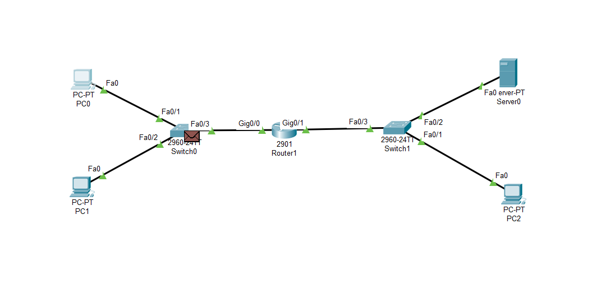

网络技术与应用实验报告（六）
==================================

-----

>专业：计算机科学与技术
>学号：2011188
>姓名：邵琦

<!-- @import "[TOC]" {cmd="toc" depthFrom=1 depthTo=6 orderedList=false} -->

<!-- code_chunk_output -->

- [一、实验要求](#一-实验要求)
  - [1.1 仿真环境下的NAT服务器配置](#11-仿真环境下的nat服务器配置)
  - [1.2 在仿真环境下完成如下实验](#12-在仿真环境下完成如下实验)
- [二、仿真环境下的NAT服务器配置](#二-仿真环境下的nat服务器配置)
  - [2.1 前期准备](#21-前期准备)
  - [2.2 实验过程](#22-实验过程)
    - [首先配置路由器接口IP地址并启动接口：](#首先配置路由器接口ip地址并启动接口)
    - [然后建立路由器地址池并且设置内网与外网：](#然后建立路由器地址池并且设置内网与外网)
    - [测试网络连通性如下：](#测试网络连通性如下)
    - [观察网络地址映射表如下图所示：](#观察网络地址映射表如下图所示)
    - [在内网主机上访问外网的Web服务器网址：](#在内网主机上访问外网的web服务器网址)
    - [在仿真环境的“模拟”方式中观察IP数据报在互联网中的传递过程，并对IP数据报的地址进行分析:](#在仿真环境的模拟方式中观察ip数据报在互联网中的传递过程并对ip数据报的地址进行分析)
- [三、内部网络中放置一台Web服务器](#三-内部网络中放置一台web服务器)
  - [3.1 前期准备](#31-前期准备)
  - [3.2 实验过程](#32-实验过程)
    - [首先建立外网主机访问内网服务器接口:](#首先建立外网主机访问内网服务器接口)
    - [测试网络连通性:](#测试网络连通性)
    - [在外网主机上访问内网的Web服务器网址:](#在外网主机上访问内网的web服务器网址)
- [四、实验总结](#四-实验总结)

<!-- /code_chunk_output -->

# 一、实验要求

## 1.1 仿真环境下的NAT服务器配置

在仿真环境下完成NAT服务器的配置实验，要求如下：

（1）学习路由器的NAT配置过程。

（2）组建由NAT连接的内网和外网。

（3）测试网络的连通性，观察网络地址映射表。

（4）在仿真环境的“模拟”方式中观察IP数据报在互联网中的传递过程，并对IP数据报的地址进行分析。

## 1.2 在仿真环境下完成如下实验

将内部网络中放置一台Web服务器，请设置NAT服务器，使外部主机能够顺利使用该Web服务。

# 二、仿真环境下的NAT服务器配置

## 2.1 前期准备

配置如下图所示：

配置主机A、B、C和Web服务器的IP地址：

PC或端口号|IPv4 Address|Subnet Mask|网关
-|-|-|-
主机A|10.0.0.2|255.0.0.0|10.0.0.1
主机B|10.0.0.3|255.0.0.0|10.0.0.1
主机C|202.113.25.101|255.255.255.0|202.113.25.1
Web服务器|202.113.25.100|255.255.255.0|202.113.25.1

## 2.2 实验过程

### 首先配置路由器接口IP地址并启动接口：

### 然后建立路由器地址池并且设置内网与外网：

### 测试网络连通性如下：

可以发现用主机A ping 外网的Web服务器，如图所示网络连通。

### 观察网络地址映射表如下图所示：

### 在内网主机上访问外网的Web服务器网址：

### 在仿真环境的“模拟”方式中观察IP数据报在互联网中的传递过程，并对IP数据报的地址进行分析:

用主机A ping 主机PC2，可以看到其中一次数据包的传送路径如下图所示：

可以看到数据包的传输路径完全正确。

# 三、内部网络中放置一台Web服务器

## 3.1 前期准备

在1的网络图的基础上，在内网添加一个Web服务器。配置如下图所示：

配置主机A、B、C和Web服务器的IP地址：

PC或端口号|IPv4 Address|Subnet Mask|网关
-|-|-|-
主机A|10.0.0.2|255.0.0.0|10.0.0.1
主机B|10.0.0.3|255.0.0.0|10.0.0.1
主机C|202.113.25.101|255.255.255.0|202.113.25.1
Web服务器0|202.113.25.100|255.255.255.0|202.113.25.1
Web服务器1|10.0.0.4|255.0.0.0|10.0.0.1

## 3.2 实验过程

### 首先建立外网主机访问内网服务器接口:

### 测试网络连通性:

利用内网主机PC0 ping 外网的主机PC2，如下图所示网络连通：

### 在外网主机上访问内网的Web服务器网址:

# 四、实验总结

通过本次实验，我对路由器的NAT服务器配置有了更深入的了解与认识，对于Web服务器、内网和外网等相关知识有了比较深刻的理解。