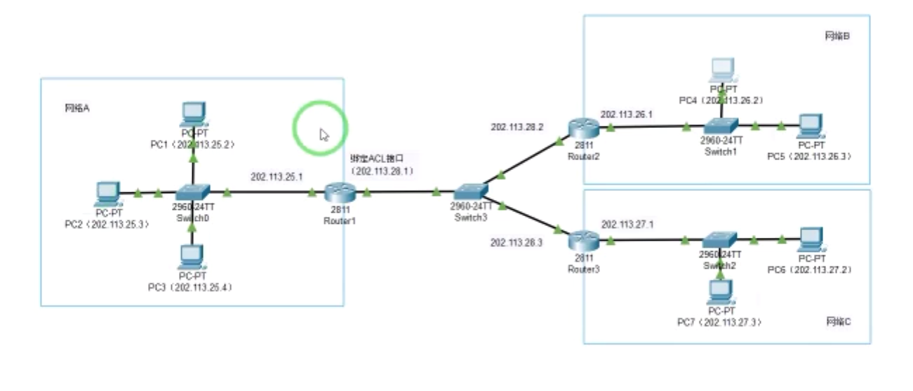

网络技术与应用实验报告（七）
==================================

-----

>专业：计算机科学与技术
>学号：2011188
>姓名：邵琦


<!-- @import "[TOC]" {cmd="toc" depthFrom=1 depthTo=6 orderedList=false} -->

<!-- code_chunk_output -->

- [网络技术与应用实验报告（七）](#网络技术与应用实验报告七)
- [一、实验要求](#一实验要求)
  - [1.1 防火墙实验](#11-防火墙实验)
- [二、标准ACL配置防火墙](#二标准acl配置防火墙)
  - [2.1 前期准备](#21-前期准备)
    - [学习包过滤防火墙配置命令：](#学习包过滤防火墙配置命令)
      - [为路由器接口设置IP地址和掩码并启动接口](#为路由器接口设置ip地址和掩码并启动接口)
      - [为路由器配置静态路由并查看路由表](#为路由器配置静态路由并查看路由表)
      - [利用标准ACL配置路由器的访问控制列表](#利用标准acl配置路由器的访问控制列表)
  - [2.2 实验过程](#22-实验过程)
    - [配置如下图所示：](#配置如下图所示)
    - [配置各主机IP地址：](#配置各主机ip地址)
    - [配置路由器接口IP和静态路由：](#配置路由器接口ip和静态路由)
      - [路由器接口IP：](#路由器接口ip)
      - [静态路由：](#静态路由)
    - [为路由器Router0配置标准ACL](#为路由器router0配置标准acl)
    - [测试网络连通性](#测试网络连通性)
- [三、标准ACL配置防火墙](#三标准acl配置防火墙)
  - [3.1 前期准备](#31-前期准备)
    - [学习包过滤防火墙配置命令：](#学习包过滤防火墙配置命令-1)
      - [利用扩展ACL配置路由器的访问控制列表](#利用扩展acl配置路由器的访问控制列表)
  - [3.2 实验过程](#32-实验过程)
    - [配置如下图所示：](#配置如下图所示-1)
    - [为路由器Router0配置扩展ACL](#为路由器router0配置扩展acl)
    - [测试网络连通性](#测试网络连通性-1)
- [四、实验总结](#四实验总结)

<!-- /code_chunk_output -->


# 一、实验要求

## 1.1 防火墙实验

防火墙实验在虚拟仿真环境下完成，要求如下：

（1）了解包过滤防火墙的基本配置方法、配置命令和配置过程。

（2）利用标准ACL，将防火墙配置为只允许某个网络中的主机访问另一个网络。

（3）利用扩展ACL，将防火墙配置为拒绝某个网络中的某台主机访问网络中的Web服务器。

（4）将防火墙配置为允许内网用户自由地向外网发起TCP连接，同时可以接收外网发回的TCP应答数据包。但是，不允许外网的用户主动向内网发起TCP连接。（选做）

# 二、标准ACL配置防火墙

## 2.1 前期准备

### 学习包过滤防火墙配置命令：

#### 为路由器接口设置IP地址和掩码并启动接口

```
Router(config)#inference GigabitEthernet0/0
Router(config-if)#ip address 202.113.25.1 255.255.255.0
Router(config-if)#no shutdown
Router(config-if)#exit
Router(config)#
```

#### 为路由器配置静态路由并查看路由表

```
Router(config)#ip route 202.113.26.0 255.255.255.0 202.113.28.2
Router(config)#exit
Router#show ip route
```

#### 利用标准ACL配置路由器的访问控制列表

```
Router(config)#access-list 6 permit 202.113.26.0 0.0.0.255
Router(config)#access-list 6 deny any
Router(config)#interface fa0/1
Router(config-if)ip access-group 6 in
Router(config-if)#exit
Router(config)#
```

## 2.2 实验过程

### 配置如下图所示：



### 配置各主机IP地址：


### 配置路由器接口IP和静态路由：

#### 路由器接口IP：

路由器|接口|IPv4地址
-|-|-
Router0|fa0/0|202.113.25.1
Router0|fa0/1|202.113.28.1
Router1|fa0/0|202.113.26.1
Router1|fa0/1|202.113.28.2
Router2|fa0/0|202.113.27.1
Router2|fa0/1|202.113.28.3

#### 静态路由：

路由器|目的网络前缀|网络掩码|下一路由
-|-|-|-
Router0|202.113.26.0|255.255.255.0|202.113.28.2
Router0|202.113.27.0|255.255.255.0|202.113.28.3
Router1|202.113.25.0|255.255.255.0|202.113.28.1
Router1|202.113.27.0|255.255.255.0|202.113.28.3
Router2|202.113.25.0|255.255.255.0|202.113.28.1
Router2|202.113.26.0|255.255.255.0|202.113.28.2

### 为路由器Router0配置标准ACL

允许网络B中的主机访问网络A中的主机，不允许网络C中的主机访问网络A中的主机。


### 测试网络连通性

利用网络B中的主机PC5 ping 网络A中的主机PC2，如下图所示网络连通：


利用网络C中的主机PC6 ping 网络A中的主机PC2，如下图所示无法连通：


# 三、标准ACL配置防火墙

## 3.1 前期准备

### 学习包过滤防火墙配置命令：

#### 利用扩展ACL配置路由器的访问控制列表

```
Router(config)#access-list 106 deny tcp host 202.113.26.2 host 202.113.25.3 eq
80
Router(config)#access-list 106 permit ip any any
Router(config)#interface fa0/1
Router(config-if)ip access-group 106 in
Router(config-if)#exit
Router(config)#
```

## 3.2 实验过程

### 配置如下图所示：


### 为路由器Router0配置扩展ACL

不允许网络B中的主机访问网络A中的服务器，允许其他主机访问网络A中的服务器。


### 测试网络连通性

用网络B中的主机PC4访问网络A中的服务器Server0，如下图所示访问失败：


用网络C中的主机PC7访问网络A中的服务器Server0，如下图所示访问成功：


# 四、实验总结

通过本次实验，我对包过滤防火墙的基本配置方法、配置命令和配置过程有了更深入的了解与认识，并且学会了使用标准ACL以及扩展ACK进行防火墙相关配置。