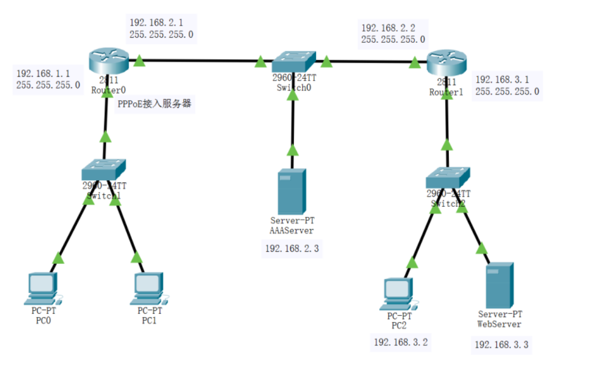
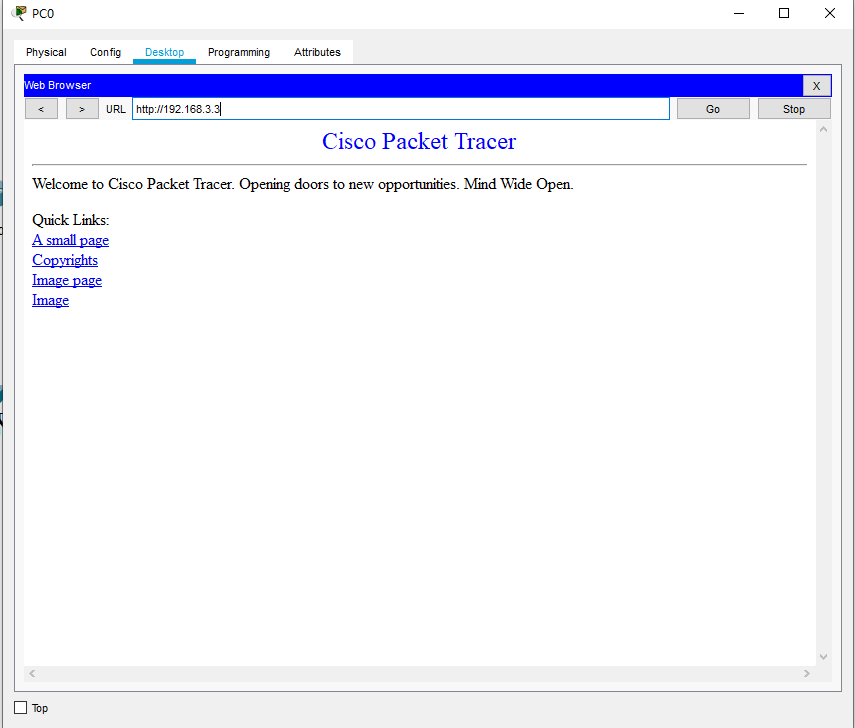

网络技术与应用实验报告（八）
==================================

-----

>专业：计算机科学与技术
>学号：2011188
>姓名：邵琦


<!-- @import "[TOC]" {cmd="toc" depthFrom=1 depthTo=6 orderedList=false} -->

<!-- code_chunk_output -->

- [一、实验要求](#一-实验要求)
- [二、前期准备](#二-前期准备)
  - [学习PPPoE的配置命令](#学习pppoe的配置命令)
    - [为路由器接口设置IP地址和掩码并启动接口](#为路由器接口设置ip地址和掩码并启动接口)
    - [为路由器配置静态路由并查看路由表](#为路由器配置静态路由并查看路由表)
    - [配置路由器的本地AAA认证](#配置路由器的本地aaa认证)
    - [创建地址池](#创建地址池)
    - [配置虚拟接口模板](#配置虚拟接口模板)
    - [创建BBA组](#创建bba组)
    - [配置物理接口](#配置物理接口)
- [三、实验过程](#三-实验过程)
    - [配置如下图所示：](#配置如下图所示)
    - [配置路由器接口IP地址和默认路由以及配置主机和服务器IP地址（如上图所示）](#配置路由器接口ip地址和默认路由以及配置主机和服务器ip地址如上图所示)
    - [配置路由器Router0的本地AAA认证](#配置路由器router0的本地aaa认证)
    - [配置服务器AAAServer](#配置服务器aaaserver)
    - [配置路由器Router0的PPPoE服务](#配置路由器router0的pppoe服务)
    - [主机PC0连接PPPoE服务](#主机pc0连接pppoe服务)
    - [测试PPPoE服务](#测试pppoe服务)
- [四、实验总结](#四-实验总结)

<!-- /code_chunk_output -->


# 一、实验要求

PPPoE服务器配置和应用实验在虚拟仿真环境下完成，要求如下：

（1）仿真有线局域网接入互联网的场景，正确配置PPPoE服务器的认证协议、地址池、虚拟模板和物理接口，使内网用户经认证后才能正常访问外部互联网。

（2）（选做）仿真家庭网络中，无线和有线终端（主机、智能电话等）连入小型路由器，由小型路由器统一接入互联网服务运营商PPPoE服务器的场景。对小型路由器和PPPoE服务器进行设置，使家庭网络中的用户经认证后才能正常访问外部互联网。

# 二、前期准备

## 学习PPPoE的配置命令

### 为路由器接口设置IP地址和掩码并启动接口

```
Router(config)#inference GigabitEthernet0/0
Router(config-if)#ip address 192.168.1.1 255.255.255.0
Router(config-if)#no shutdown
Router(config-if)#exit
Router(config)#
```

### 为路由器配置静态路由并查看路由表

```
Router(config)#ip route 192.168.3.0 255.255.255.0 192.168.2.2
Router(config)#exit
Router#show ip route
```

### 配置路由器的本地AAA认证

```
Router>enable
Router#config terminal
Router(config)#aaa new-model
Router(config)#aaa authentication ppp myPPPoE group radius
Router(config)#radius-server host 192.168.2.3 auth-port 1645 key radius123
Router(config)#
```

### 创建地址池

```
Router(config)#ip local pool myPool 192.168.1.100 192.168.1.200
Router(config)#
```

###  配置虚拟接口模板

```
Router(config)#interface virtual-template 1
Router(config-if)#ip unnumber fa0/0
Router(config-if)#peer default ip address pool myPool
Router(config-if)#ppp authentication chap myPPPOE
Router(config-if)#exit
Router(config)#
```

### 创建BBA组

```
Router(config)#bba-group pppoe myBBAGroup
Router(config-bba)#
Router(config-bba)#virtual-template 1
Router(config-bba)#exit
Router(config)#
```

### 配置物理接口

```
Router(config)#interface fa0/0
Router(config-if)#pppoe enable group myBBAGroup
Router(config-if) #exit
Router(config)#
```

# 三、实验过程

### 配置如下图所示：



### 配置路由器接口IP地址和默认路由以及配置主机和服务器IP地址（如上图所示）

### 配置路由器Router0的本地AAA认证


### 配置服务器AAAServer


### 配置路由器Router0的PPPoE服务

步骤如实验准备所示。

### 主机PC0连接PPPoE服务


### 测试PPPoE服务

用主机PC0 ping 主机PC2，如下图所示连通成功：


用主机PC0 访问服务器WebServer网页，如下图所示访问成功：



查看PPPoE分配给PC0的IP地址：


# 四、实验总结

通过本次实验，我学会了虚拟仿真环境下的PPPoE服务器配置和应用，能够正确配置PPPoE服务器的认证协议、地址池、虚拟模板和物理接口，对于仿真有线局域网接入互联网的场景有了更为深刻的理解与认识。